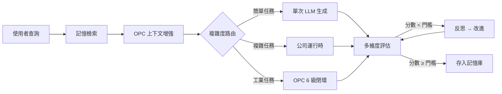

<div align="center">

# 靈境·Linkin

**EvoLoop 運行時 × 世界觀 × 監控中心**

本倉庫基於 [EvoLoop](https://github.com/iiooiioo888/Evoloop)（MIT）衍生，保留其自我反思閉環、多代理人公司與工業 OPC 能力，並整合靈境世界觀與監控中心。

生成 → 評估 → 反思 → 優化，永不停止進化的 AI 系統

[](https://www.python.org/)
[](https://fastapi.tiangolo.com/)
[](https://github.com/langchain-ai/langgraph)
[](https://react.dev/)
[](backend/tests/)
[](LICENSE)

**倉庫：** [https://github.com/iiooiioo888/Linkin](https://github.com/iiooiioo888/Linkin)

**上游基礎：** [https://github.com/iiooiioo888/Evoloop](https://github.com/iiooiioo888/Evoloop)（MIT License，署名保留）

**線上預覽（EvoLoop 靜態 Demo）：** [https://iiooiioo888.github.io/Evoloop/](https://iiooiioo888.github.io/Evoloop/)  
（靜態 UI；聊天、寫入與模型刷新需本地或 Docker 啟動完整服務）

> **單一主線** · 分支僅 `master` · 最近文件更新：2026-09-04

</div>

---

## 📖 目錄

- [什麼是 EvoLoop？](#-什麼是-evoloop)
- [本版亮點](#-本版亮點)
- [單一版本說明](#-單一版本說明)
- [架構總覽](#️-架構總覽)
- [專案結構](#-專案結構)
- [核心能力](#-核心能力)
- [監控中心](#-監控中心)
- [模型池與運維](#-模型池與運維)
- [系統優化](#-系統優化)
- [快速開始](#-快速開始)
- [環境變數](#️-環境變數)
- [測試](#-測試)
- [技術棧](#️-技術棧)
- [文件](#-文件)
- [常見問題](#-常見問題)
- [路線圖](#️-路線圖)

---

## 🧠 什麼是 EvoLoop？

EvoLoop 不是普通的 AI 助手——它是具備**自我反思閉環**的**統一模式** AI 系統。反思閉環、公司運行時、OPC 整合走同一條 LangGraph 管線，由 `route_by_complexity` 依任務內容自動選擇執行路徑。

| 能力 | 說明 |
|:---:|------|
| 🔄 **反思閉環** | 4 維度獨立評分（準確／完整／清晰／相關），低於門檻自動反思改進直到達標 |
| 🏢 **公司運行時** | 複雜任務自動觸發：Manager 分解 → 多角色並行 → Reviewer 審查 → Synthesizer 整合 |
| 🏭 **OPC 整合** | 工業任務注入感測上下文，6 級閉環（感知→預處理→分析→診斷→決策→執行） |
| 🖥️ **監控中心** | 活動欄五層：對話 · 控制台（EvoLoop）· 靈境（世界）· Minecraft · 實驗室 |
| 🎭 **角色目錄** | **81** 個內建角色（Level 0–4，含需求審計官）+ 自定義角色 CRUD + 執行期設定覆蓋 |
| 🔌 **模型池鎖定** | 依已存 API 鎖定可用模型；單一廠商只准該廠商；OpenRouter 等通用端點爬取 `/models` |
| ☁️ **雲控制台** | 費用帳單、資源監控、告警中心、Docker 實例管理 |
| 🧠 **語義記憶** | 向量記憶庫 + LLM 語義快取，成功經驗沉澱為 few-shot |



---

## ✨ 本版亮點

本倉庫為**單一主線**（僅 `master`），下列能力已落地：

| 主題 | 你會得到什麼 |
|------|-------------|
| **靈境·Linkin** | 活動欄獨立「靈境」：世界觀／NPC／任務／道具／工作室角色；種子：`python -m backend.scripts.seed_linkin_world` |
| **Minecraft MCP** | 獨立活動「Minecraft」（建築／橋接）；MineMCP JSON-RPC；未設 Token 乾跑 |
| **量化行情工具** | 金融角色可 `tool_call` 引用 Yahoo／東方財富／新浪／Stooq／Frankfurter／CoinPaprika／Binance（報價、31 策略回測含增強成交量／單成交量、策略庫目錄、優化、Walk-Forward、組合、資金流）；實驗室「策略庫」分類樹勾選引用，「策略圖」用 Archify 可視化全部策略；可選 Tushare／Finnhub／Alpha Vantage Token；不嵌入 stock-quant 完整工作站 |
| **監控中心擴充** | 控制台（EvoLoop 公司角色）與靈境工作室分開；自定義角色 CRUD；監控偏好 |
| **角色總覽操作** | 依 L0–L4 分組；左側層級錨點跳轉；活躍／告警為篩選而非第二套計數；卡片右上角為該角色合計成本 |
| **示範資料** | `python -m backend.scripts.seed_demo_content` 寫入 60 任務、60 推理軌跡、60 知識庫條目（Chroma 失敗則降級 JSON） |
| **通用模型優化** | 只存 DeepSeek → 全系統只能用 DeepSeek；OpenRouter／Ollama／vLLM → 爬取 `/models` 寫入配置；定時檢查 + 手動刷新 + 健康快照 |
| **GitHub / Pages** | 推送 `master` 跑 CI，並部署靜態 Demo → [iiooiioo888.github.io/Evoloop](https://iiooiioo888.github.io/Evoloop/) |

### 最近更新（2026-09-03）

- 角色總覽卡片排版：標題、狀態、合計成本（API／Docker／雲）分開，不再互相擠壓
- 左側可依層級快速跳到對應角色區塊；篩選改為「全部／活躍／告警」分段控制
- 開發前端預設 **http://localhost:3001**（Windows 上 5173 常被占用；可用 `VITE_DEV_PORT` 覆寫）
- 示範種子：任務寫入 `backend/data/company_runs/`，推理寫入 `backend/data/traces/`，知識庫寫入 Chroma `evo_memory` 與 `backend/data/memory_store.json`
- 記憶庫 API `GET /memories`：Chroma 為空或失敗時改讀 JSON 記憶檔，避免監控「記憶」分頁空白
- 前端與監控仍為**唯一版本**（`AppShell` + `MonitorView`）；CI／Pages 僅追蹤 `master`

---

## 🧩 單一版本說明

專案已**合拼為單一主線版本**：

| 項目 | 現況 |
|------|------|
| 分支 | 僅 `master`（舊 `main` 已合併停用） |
| 前端 | 一套 IDE 風格 UI；活動欄 **對話／控制台／靈境／Minecraft／實驗室** |
| 監控 | Hub 併入監控中心；導航與降級資料單一來源（`monitorTabs` / `monitorFallbacks`） |
| CI / Pages | 推送 `master` → `test.yml` 測試 + `deploy-pages.yml` 部署 GitHub Pages |
| 倉庫 | [iiooiioo888/Evoloop](https://github.com/iiooiioo888/Evoloop) → [GitHub Pages](https://iiooiioo888.github.io/Evoloop/) |

> 沒有「標準版／公司版／OPC 版」三套產品線，也沒有前後端雙 UI 分叉——複雜度路由與監控分頁都在同一條主線上。

---

## 🏗️ 架構總覽

```
┌──────────────────────────────────────────────────────────────────┐
│                     🖥️ 前端（單一版本 · React + Vite）              │
│  ActivityBar（對話／控制台／靈境／Minecraft／實驗室）│ SidePanel │ ChatView │ MonitorView │ TraceView │
│  控制台：API 路由／即時／角色／管線／用量／基礎設施                               │
│  靈境：世界觀／NPC／任務／道具／工作室角色                                         │
│  Minecraft：建築方案／MineMCP 橋接                                                 │
└───────────────────────────────┬──────────────────────────────────┘
                                │ REST + WebSocket + SSE
┌───────────────────────────────┴──────────────────────────────────┐
│                    ⚙️ 後端（FastAPI + LangGraph）                   │
│  反思閉環 │ 公司運行時 │ OPC │ role_catalog │ provider_pool       │
│  LLMCache · Evaluation · StateStore · VectorMemory · llm_ops     │
└───────────────────────────────┬──────────────────────────────────┘
                                │
┌───────────────────────────────┴──────────────────────────────────┐
│                    🗄️ Docker Compose                              │
│         Redis · ChromaDB · OPC Simulator · Nginx                 │
└──────────────────────────────────────────────────────────────────┘
```

### 公司運行時內部流程

```
Manager 分解目標
  │  TaskDecomposer（LLM / 模板 / 規則）
  ▼
工作項 DAG → 並行執行池（自適應並發）
  ▼
Reviewer 審查閘（通過 / Rework / 角色升級）
  ▼
Synthesizer 整合 → 外部反思回圈
```

---

## 📁 專案結構

```
linkin/                          # 本倉庫目錄名（基於 EvoLoop）
├── backend/                     # FastAPI + LangGraph
│   ├── main.py                  #   /chat /tasks /monitor/* /linkin/* /config /cloud /docker
│   ├── linkin/                  #   靈境憲法 / NPC / 任務 / 建築 / 道具 / Minecraft 護欄
│   ├── tools/                   #   Minecraft MCP JSON-RPC 封裝
│   ├── core/
│   │   ├── graph.py             #     統一模式圖 + 複雜度路由
│   │   ├── nodes.py             #     生成 / 多維評估 / 分層反思 / 改進
│   │   ├── provider_pool.py     #     依 API 鎖定模型池 + 爬取目錄
│   │   ├── llm_config.py        #     運行時 LLM 配置持久化
│   │   ├── llm.py               #     LiteLLM 統一調用（含 clamp_model）
│   │   ├── evaluation.py        #     4 維評估引擎
│   │   └── llm_cache.py         #     精確 + 語義快取
│   ├── company/
│   │   ├── roles.py             #     81 個內建角色 + 組織模板
│   │   ├── role_catalog.py      #     角色設定覆蓋 + 自定義角色持久化
│   │   ├── orchestrator.py      #     公司協調器
│   │   ├── tools.py             #     公司工具註冊（實驗室／Minecraft／量化）
│   │   ├── quant_tools.py       #     角色可呼叫的免費行情／回測／資金流工具
│   │   ├── quant_strategy_catalog.py  #  stock-quant 策略庫目錄（分類／別名）
│   │   ├── quant_strategy_maps.py     #  策略庫 → Archify IR（可視化）
│   │   └── ...
│   ├── hub/                     #   AI Hub（探針 / 熔斷 / 目錄）
│   ├── services/
│   │   ├── agent_monitor.py     #     角色 Agent 監控聚合
│   │   ├── llm_ops.py           #     模型目錄定時刷新迴圈
│   │   ├── cloud_console.py     #     雲控制台聚合
│   │   ├── docker_manager.py    #     容器狀態／啟停
│   │   └── ...
│   ├── data/
│   │   ├── linkin/              #     世界觀種子 JSON
│   │   ├── linkin_constitution.json
│   │   ├── role_catalog.json    #     角色目錄資料
│   │   ├── memory_store.json    #     JSON 記憶降級檔
│   │   ├── company_runs/        #     公司任務事件（含示範種子）
│   │   └── traces/              #     推理軌跡
│   ├── scripts/
│   │   ├── seed_demo_content.py #     60 任務／推理／知識庫
│   │   └── seed_linkin_world.py #     靈境世界觀／NPC／角色種子
│   └── tests/                   #   單元測試
├── opc_service/                 # OPC UA 工業微服務 + 安全護欄
├── frontend/                    # React + Vite + TypeScript（單一 UI）
│   └── src/
│       ├── api/linkin.ts        #   靈境 REST 客戶端
│       ├── lib/monitorTabs.ts   #   監控分頁單一資料源
│       ├── lib/agentUi.ts       #   角色狀態／跳轉事件 / 成本格式
│       └── components/
│           ├── MonitorView.tsx
│           ├── AgentsMonitorPanel.tsx
│           ├── RoleSettingsPanel.tsx
│           ├── LlmOpsPanel.tsx
│           ├── HubPanel.tsx      #   Hub 操作台（內嵌於監控，非獨立產品線）
│           ├── StrategyCatalogPanel.tsx  # 實驗室回測策略庫分類樹
│           ├── StrategyMapPanel.tsx      # Archify 策略可視化
│           ├── ArchifyFrame.tsx          # archify CLI HTML 嵌入
│           ├── ArchifyViewer.tsx         # Archify IR → SVG 後備
│           ├── linkin/          #   憲法／NPC／任務／建築／道具／Minecraft 橋接
│           └── ...
├── docs/                        # 知識庫（含 docs/linkin/）
├── .github/workflows/
│   ├── test.yml                 #   master CI
│   └── deploy-pages.yml         #   GitHub Pages
├── docker-compose.yml
├── LICENSE
└── requirements.txt
```

---

## ✨ 核心能力

### 🔄 反思閉環

| 特性 | 說明 |
|------|------|
| **4 維度評分** | 準確性 35% · 完整性 30% · 清晰度 20% · 相關性 15% |
| **規則 Fallback** | LLM 評估失敗時用啟發式規則，不再一律 0 分 |
| **交叉評估** | 可選第二模型覆核 |
| **動態迭代** | 分數變化率過低提前終止 |
| **分層反思** | 低分深度反思／中分表面修正 |
| **LLM 語義快取** | 精確匹配 + embedding 語義命中（預設 > 0.92） |
| **記憶去重／蒸餾** | 相似度去重 + 定期摘要合併 |

### 🏢 多代理人公司與角色

| 特性 | 說明 |
|------|------|
| **內建角色** | **81** 席，Level 0–4 |
| **角色目錄** | `role_catalog`：內建設定覆蓋 + 自定義角色 CRUD |
| **角色設定** | Prompt、職責、偏好模型、日／週／月預算、工具、路由、告警、SLA…（見下表） |
| 組織模板 | `page_dev` / `fullstack_app` / `research_report` / `quick_task` / `full_company` 等 |
| 工作項狀態機 | Planning → Ready → Executing → In Review → Rework / Done / Blocked |
| 錯誤回退 | 公司失敗但有部分產出 → 降級反思閉環繼續優化 |
| SSE 即時串流 | 分解／執行／審查／整合各階段進度推送 |
| **量化工具** | 金融角色可呼叫 `market_quote`／`market_backtest`／`market_portfolio`／`fx_rate`／`crypto_quote`（Yahoo 主源，免費 JSON API） |

#### 內建角色層級

| Level | 數量 | 範例 |
|------|:----:|------|
| 0 Manager | 1 | 專案經理 |
| 1 Lead | 10 | 技術／架構／資安／產品／財務／工業／創意／平台／AI／成長主管 |
| 2 Domain Lead | 4 | 前端／後端／測試／資料主管 |
| 3 Executor | 54 | UI、DevOps、OPC、RAG、評測、PLC／IoT、GitHub Ops、Hub 執勤… |
| 4 Support | 11 | 審查者、整合者、Prompt、法務、記憶策展、知識庫… |

#### 角色可編輯設定（摘要）

| 類別 | 欄位 |
|------|------|
| 身分 | `name`、`description`、`level`、`category`、`tags`、`enabled` |
| Prompt | `system_prompt`、`responsibilities`、`language` |
| 模型 | `preferred_model`（經 `clamp_model`）、`failover_models`、`routing_strategy` |
| 預算 | `daily_budget_usd` / `weekly_budget_usd` / `monthly_budget_usd`、`default_tier` |
| 執行 | `temperature`、`max_output_tokens`、`timeout_ms`、`max_retries`、`max_parallel_work` |
| 治理 | `tools_allowed`、`always_require_review`、`require_human_approval`、`auto_escalate` |
| 告警 | `alert_on_error` / `budget` / `sla`、`notify_channel`、`quiet_hours`、`on_call` |
| 其他 | `stream_enabled`、`cache_enabled`、`pii_redact`、`heartbeat_sec`、`priority` |

資料寫入 `backend/data/role_catalog.json`（可用 `EVOL_ROLE_CATALOG_PATH` 覆寫）。

### 💰 預算管控

| 特性 | 說明 |
|------|------|
| 模型路由 | 依任務複雜度選 tier（routine / normal / critical） |
| **模型池 clamp** | 路由與角色偏好模型一律經 `clamp_model` 鎖在可用池內 |
| 動態價格 | `backend/config/model_costs.json`，支援熱更新 |

### 🏭 OPC UA 工業整合

| 特性 | 說明 |
|------|------|
| 6 級閉環 | 感知 → 預處理 → 分析 → 診斷 → 決策 → 執行 |
| 安全護欄 | 寫入白名單 + 數值邊界 + 審計日誌（禁止繞過） |
| 超時降級 | 每級可超時後用上一級快取繼續 |

### 📈 量化行情（角色工具）

對齊 [stock-quant](https://github.com/iiooiioo888/stock-quant) 的報價／K 線／分鐘線／31 策略回測（含博客內建 `enhanced_volume`／`single_volume`）／策略庫目錄／優化／Walk-Forward／11 種組合／資金流／基準對比，交由量化研究桌角色引用。實驗室 **策略庫**（`#/monitor/lab/quant`）以分類樹瀏覽可回測／規劃項；**策略圖**（`#/monitor/lab/maps`）把 [Archify](https://github.com/tt-a1i/archify) 列為前端依賴（`file:../vendor/archify`）並呼叫其 CLI，把全部策略畫成總覽、分類拓撲與工作流。角色可 `archify_strategies`。不嵌入 stock-quant 完整工作站 UI。

| 工具 | 資料源 | 說明 |
|------|--------|------|
| `market_quote` / `market_kline` / `market_realtime` | Yahoo（A 股備援東財／新浪，美股備援 Stooq） | 最新價、歷史 K 線、即時盤口 |
| `market_minutes` | 東方財富 | A 股分鐘線 |
| `market_backtest` / `market_compare` | 同上 | 31 種引擎（含增強成交量／單成交量）；對比依夏普排序；可設 T+1／漲跌停／移動止損 |
| `market_strategy_catalog` | — | 分類／搜尋策略庫；`wired` 可回測，其餘為目錄／規劃 |
| `archify_strategies` | — | 策略庫 → Archify IR（總覽／分類／單策略工作流） |
| `market_optimize` / `market_walkforward` / `market_heatmap` | 同上 | 網格尋優、樣本外驗證、參數熱力圖 |
| `market_signals` / `market_leaderboard` | 同上 | 多空投票與跨標的排行 |
| `market_watch` | 同上 | 漲跌、MA20、均線訊號 |
| `market_screener` / `market_fundamentals` | 東方財富 | A 股快照與 PE／PB／ROE |
| `market_capital_flow` / `market_flow` / `market_north_flow` / `market_dragon_tiger` / `market_sectors` | 東方財富 | 個股／大盤資金流、北向、龍虎榜、板塊 |
| `market_benchmark` / `market_returns` | Yahoo／東財 | 相對滬深300、多股區間收益 |
| `market_portfolio` | Yahoo／東財 | 等權／風險平價／Kelly／MVO 等 11 種 |
| `fx_rate` | Frankfurter（currency-api 備援） | 免註冊匯率 |
| `crypto_quote` | CoinPaprika（CoinGecko／Binance 備援） | 無需 API Key |

可選環境變數：`EVOL_TUSHARE_TOKEN`、`EVOL_FINNHUB_TOKEN`、`EVOL_ALPHAVANTAGE_KEY`。詳見 [docs/company/quant-tools.md](docs/company/quant-tools.md)。

---

## 🖥️ 監控中心

前端**只有一套主視圖**（`MonitorView`）。左側三層：活動欄（對話／控制台／靈境／Minecraft／實驗室）→ 側欄分組 → 主區。分頁定義在 `frontend/src/lib/monitorTabs.ts`。

**控制台**（EvoLoop 原功能，不含 Minecraft）：

| 分組 | 分頁 | 說明 |
|------|------|------|
| **配置** | **API 路由** | 多 API 金鑰、模型目錄、分發策略；側欄列已配置 API |
| **執行** | 即時 | 總覽看板：工作流（配置 API → 指定角色 → 執行 → 觀測）、API 池、角色、管線 |
| | 任務 | 佇列與進度 |
| | 角色 | EvoLoop 公司角色工作台（不含靈境工作室班底）；「設定」可新增自定義角色 |
| | 管線 | 反思閉環階段圖 |
| | 軌跡 | 執行步驟（側欄獨立入口） |
| **觀測** | 運行指標 | 快取／反思／優化路線圖（非工業 OPC） |
| | 調用用量 | Trace 彙總的延遲與成本 |
| | 用戶反饋 | 評分紀錄 |
| **系統** | 記憶 | 向量檢索 |
| | 基礎設施 | AI Hub／雲端／檢查點／連接池 |

**靈境**（世界內容，不連遊戲伺服器）：

| 分組 | 分頁 | 說明 |
|------|------|------|
| **世界** | 世界觀／NPC／任務／道具 | 憲法、角色卡、主線支線、稀有度；陣營／NPC／道具以 neiki-gallery 燈箱瀏覽 |
| **工作室** | 工作室角色 | 建築／敘事／NPC／道具班底（建築總監等），不進控制台「執行 → 角色」 |

**Minecraft**（獨立活動，與靈境、控制台分開）：

| 分組 | 分頁 | 說明 |
|------|------|------|
| **伺服器** | 建築 | Schematic 生成、3D 預覽、方案畫廊、派發到世界 |
| | 橋接 | MineMCP 探測、工具呼叫、審計 |

**實驗室**獨立活動：提示詞／爬蟲／架構／精簡／**策略庫**，以及 OPC／記憶等通用 MCP 開關（不含 Minecraft 工具）。

頂欄齒輪為 **快速加入 API**（與控制台 API 路由共用同一編輯器）。EvoLoop 角色級模型與 Token 只在控制台「執行 → 角色 → 設定」指定；靈境班底在「靈境 → 工作室」。

### 圖表與影像

| 庫 | 用途 |
|------|------|
| **Apache ECharts** | 控制台／實驗室／雲監控／回測曲線（Apache-2.0，免費、無需授權金鑰） |
| **neiki-gallery** | NPC／道具／陣營／任務／建築方案畫廊；爬蟲抓到的圖；對話 Markdown 圖片燈箱。含砌體、網格、馬賽克、畫中畫 |

圖表入口：`frontend/src/components/charts/`。畫廊入口：`frontend/src/components/media/MediaGallery.tsx`（vendor：`frontend/src/vendor/neiki-gallery/`）。

### 監控偏好（角色 Agent）

| 偏好 | 說明 |
|------|------|
| `poll_interval_ms` | 輪詢間隔 |
| `group_by` | 依 level／category 分組 |
| `show_disabled` / `show_idle` / `show_custom_only` | 顯示篩選 |
| 活躍／告警分段 | 頂部「全部／活躍／告警」是篩選，不是第二套 80/80 計數 |
| `compact_cards` | 緊湊卡片 |
| `default_desk_tab` | 預設工作台分頁 |

### 相關 API

- `GET/POST/PUT/DELETE /monitor/agents*` — Agent 監控、偏好、角色設定、自定義角色
- `GET /monitor/opc` · `GET /monitor/hub` · `GET /monitor/llm-ops`
- `POST /config/models/refresh` · `PUT /config/ops`
- `GET/PUT /config` · `POST /config/test`
- `GET/PUT/POST/DELETE /config/routes` · `POST /config/routes/{id}/refresh` · `POST /config/routes/{id}/test` · `PUT /config/strategy`
- `GET /docker/*` · `GET/POST /cloud/*` — 實例與雲控制台
- `GET /lab/quant/strategies` — 回測策略庫分類樹（實驗室瀏覽）
- `GET /lab/archify/strategies` — 策略庫 Archify 總覽／分類拓撲
- `GET /lab/archify/strategies/{id}` — 單策略工作流／生命週期 IR
- `GET /lab/archify/html` — 以 archify CLI 渲染策略圖 HTML（`view=overview|data_flow|lifecycle|group|strategy`）
- `GET /lab/archify/artifact` — 同一張圖的 `text/html`（iframe 可直接載入）
- `POST /lab/archify/render` — 把簡化 IR 交給 archify CLI
- `GET /memories` · `DELETE /memories/{id}` · `POST /memories/cleanup` — 記憶庫；Chroma 空則讀 JSON

---

## 🔌 模型池與運維

核心模組：`backend/core/provider_pool.py` + `backend/core/api_router.py` + `backend/services/llm_ops.py`。

### API 分割（多 API / 多模型）

可同時保存多組供應商憑證（千問、DeepSeek、Kimi、OpenRouter…）。千問與 OpenRouter 各自有多個模型；請求依 **角色指定** 或 **全域策略**（加權輪詢／隨機／最少負載／故障轉移）分發。

| 能力 | 說明 |
|------|------|
| 多 API 並存 | 控制台 **配置 → API 路由**（或頂欄齒輪）可加入多條路由，每條獨立金鑰、端點、模型目錄 |
| 多模型 | 千問：qwen-plus / max / turbo…；OpenRouter：爬取 `/models` |
| 角色級設定 | 每個角色可獨立指定供應商、模型、輸出 Token、上下文 Token，以及故障轉移模型 |
| 向後相容 | 未設定 `api_routes` 時，頂層單一 `api_key` 仍視為預設路由 |

### 鎖定規則

| 情境 | 行為 |
|------|------|
| 只配置 DeepSeek（或 Qwen／Moonshot／智譜／MiMo 等單一廠商） | Agent **只能**使用該廠商模型，不會落到無關的預設模型 |
| 同時配置多組 API | Agent 可用任一已配置路由的模型；角色可鎖定某一組 API |
| OpenRouter／Ollama／vLLM／OpenAI 相容通用端點 | `GET /models` 爬取可用目錄，寫入運行時配置 |
| 角色偏好模型不在該 API 池內 | 自動 `clamp` 到該路由第一個可用模型 |
| Hub 目錄 | 與目前 API 可用池取交集（只存 DeepSeek 時 Hub 只顯示相容列） |
| Claude／Anthropic | **禁止**進入可用池 |

### 支援的供應商識別

| 類型 | 範例端點／主機 | 行為 |
|------|----------------|------|
| DeepSeek | `api.deepseek.com` | 靜態廠商模型表鎖定 |
| Qwen | `dashscope.aliyuncs.com` | 靜態鎖定 |
| Moonshot / Kimi | `api.moonshot.cn` / `.ai` | 靜態鎖定 |
| 智譜 GLM | `open.bigmodel.cn` | 靜態鎖定 |
| OpenAI | `api.openai.com` | 靜態 + 可爬取 |
| OpenRouter | `openrouter.ai` | 爬取 `/models` |
| Ollama／通用 | 本地或相容 base URL | 爬取 `/models` |

### 運維能力

| 能力 | 說明 |
|------|------|
| 定時檢查 | 背景迴圈依間隔刷新模型目錄（預設 300 秒） |
| 手動刷新 | 控制台 **配置 → API 路由** 或 `POST /config/models/refresh` |
| 健康快照 | 上次成功時間、延遲、連續失敗、是否過期（stale） |
| 開關 | `EVOL_LLM_OPS_ENABLED` / `EVOL_LLM_OPS_INTERVAL_SEC` |

**範例 A — 單一廠商：**

```env
OPENAI_API_KEY=sk-your-deepseek-key
OPENAI_API_BASE=https://api.deepseek.com
EVOL_MODEL=deepseek-v4-flash
```

→ 全系統 Agent 鎖定 `deepseek-v4-*`。

**範例 B — OpenRouter 通用 API：**

```env
OPENAI_API_KEY=sk-or-...
OPENAI_API_BASE=https://openrouter.ai/api/v1
EVOL_LLM_OPS_ENABLED=true
EVOL_LLM_OPS_INTERVAL_SEC=300
```

→ 定時／手動爬取 `/models`，目錄寫入配置與監控面板；Agent 只能從該目錄選用。

**範例 C — 多 API 分割：** 在控制台「配置 → API 路由」同時加入千問與 DeepSeek；開發者角色指定 `qwen-max`，審查者角色指定 `deepseek-v4-pro`。全域策略可維持「角色指定優先」。

---

## 🔬 系統優化

| # | 方向 | 說明 |
|---|------|------|
| 1–16 | 既有架構優化 | 多維評分、錯誤回退、語義快取、動態迭代、記憶品質、自適應並發、StateStore、SSE、價格動態化、OPC 降級、公司串流、記憶去重／蒸餾、Prompt 壓縮、品質門 |
| 17 | **模型池鎖定** | 依 API 供應商鎖定可用模型，禁止跨廠商誤用 |
| 17b | **API 分割** | 多組 API 並存；角色級模型／Token；加權輪詢與故障轉移 |
| 18 | **通用目錄爬取** | OpenRouter 等端點定時／手動同步 `/models` |
| 19 | **角色目錄** | 監控中心可編輯內建設定並建立自定義角色（80 席） |
| 20 | **單一前端版本** | Hub 併入監控中心；Pages／CI 單一主線 |

詳見 [知識庫](docs/README.md)。

---

## 🚀 快速開始

### 環境需求

| 工具 | 版本 | 說明 |
|------|------|------|
| Python | 3.10–3.12 | 後端 |
| Node.js | 20+ | 前端 |
| Docker | 可選 | 容器化部署 |

### 1️⃣ 安裝

```powershell
git clone https://github.com/iiooiioo888/Linkin.git
cd Linkin
# 上游基礎：https://github.com/iiooiioo888/Evoloop（MIT）

python -m venv .venv
.venv\Scripts\Activate.ps1

pip install -r requirements.txt

copy .env.example .env
# 編輯 .env：填入 API 金鑰；單一廠商請一併設定對應 api_base／模型
```

### 2️⃣ 驗證

```powershell
python backend/scripts/test_llm_connection.py
pytest backend/tests/ -q
```

### 3️⃣ 啟動

```powershell
# 後端 http://localhost:8000
python -m backend.main

# 前端 http://localhost:3001（可用 $env:VITE_DEV_PORT=5173 改回）
cd frontend && npm install && npm run dev

# 示範任務／推理／知識庫（不呼叫 LLM）
python -m backend.scripts.seed_demo_content

# OPC（可選）
$env:OPC_SIM_ENABLED="true"; python -m opc_service.main
```

### Docker Compose

```powershell
docker compose up -d
docker compose up -d redis chroma
docker compose logs -f backend
```

| 服務 | 端口 | 說明 |
|------|------|------|
| `backend` | 8000 | FastAPI + LangGraph |
| `frontend` | 3001（dev）／80（prod） | React；舊文件中的 5173 已改預設 |
| `opc_service` | 8001 | OPC UA |
| `redis` | 6379 | 任務持久化 |
| `chroma` | 8100 | 向量記憶庫 |

### GitHub Pages

推送到 `master` 後，Actions `Deploy to GitHub Pages` 會：

1. 匯出監控降級資料（單一來源：`python -m backend.scripts.export_monitor_fallback`）
2. 以 `VITE_BASE=/Evoloop/`、`VITE_GITHUB_PAGES=true` 建置前端
3. 部署至 [https://iiooiioo888.github.io/Evoloop/](https://iiooiioo888.github.io/Evoloop/)

靜態站可瀏覽 UI；完整聊天／寫入請本地或 Docker 啟動後端（可設 `VITE_API_URL`）。

手動觸發：GitHub → Actions → **Deploy to GitHub Pages** → Run workflow。

---

## ⚙️ 環境變數

### 必填／LLM

| 變數 | 預設 | 說明 |
|------|------|------|
| `OPENAI_API_KEY` | — | LLM 金鑰（LiteLLM；亦可用 DeepSeek／OpenRouter 等相容金鑰） |
| `OPENAI_API_BASE` | — | 可選端點（如 `https://api.deepseek.com`、`https://openrouter.ai/api/v1`） |
| `EVOL_MODEL` | `gpt-4o` | 預設模型（會被模型池 clamp） |
| `EVOL_PASS_THRESHOLD` | `8` | 反思通過門檻 |
| `EVOL_MAX_ITERATIONS` | `3` | 最大迭代次數 |
| `EVOL_MIN_SCORE_IMPROVEMENT` | `0.5` | 最小分數提升（低於此提前終止） |
| `EVOL_CROSS_EVAL_MODEL` | — | 交叉評估模型 |

### 模型運維

| 變數 | 預設 | 說明 |
|------|------|------|
| `EVOL_LLM_OPS_ENABLED` | `true` | 啟用背景目錄刷新 |
| `EVOL_LLM_OPS_INTERVAL_SEC` | `300` | 刷新間隔（秒，限制 60–3600） |

### 角色目錄

| 變數 | 預設 | 說明 |
|------|------|------|
| `EVOL_ROLE_CATALOG_PATH` | `backend/data/role_catalog.json` | 角色目錄持久化路徑 |

### Minecraft MCP（MineMCP）

| 變數 | 預設 | 說明 |
|------|------|------|
| `EVOL_MC_MCP_ENABLED` | `false` | `true` 才對 Paper 插件發真實 JSON-RPC |
| `EVOL_MC_MCP_URL` | `http://127.0.0.1:3000` | MineMCP 位址（不含 `/sse`） |
| `EVOL_MC_MCP_TOKEN` | — | 與 `plugins/MineMCP/config.yml` 相同；未設則乾跑 |
| `EVOL_MC_MCP_RPC_PATH` | `/sse` | JSON-RPC 路徑 |
| `EVOL_MC_MCP_WORLD` | `world` | 預設世界 |
| `EVOL_MC_MCP_MAX_FILL` | `5000` | 單次 fill 上限 |

詳見 [docs/linkin/minecraft-mcp.md](docs/linkin/minecraft-mcp.md)。

### 量化行情（免費數據源）

無需金鑰即可使用。可選：`EVOL_TUSHARE_TOKEN`、`EVOL_FINNHUB_TOKEN`、`EVOL_ALPHAVANTAGE_KEY`。角色透過 `tool_call` 呼叫 `market_quote` 等工具；網路失敗時回傳結構化錯誤，不中斷公司運行時。詳見 [docs/company/quant-tools.md](docs/company/quant-tools.md)。

### LLM 快取

| 變數 | 預設 | 說明 |
|------|------|------|
| `EVOL_LLM_CACHE_SIZE` | `512` | 快取條目上限 |
| `EVOL_LLM_CACHE_TTL` | `3600` | TTL（秒） |
| `EVOL_SEMANTIC_CACHE` | `true` | 語義快取 |
| `EVOL_SEMANTIC_THRESHOLD` | `0.92` | 語義相似度閾值 |

### 基礎設施

| 變數 | 預設 | 說明 |
|------|------|------|
| `REDIS_URL` | `redis://localhost:6379/0` | Redis |
| `CHROMA_HOST` / `CHROMA_PORT` | `localhost` / `8100` | ChromaDB |
| `OPC_SIM_ENABLED` | `false` | 模擬 OPC 伺服器 |
| `OPC_WRITE_WHITELIST` | — | 寫入白名單 |
| `OPC_STAGE_TIMEOUT` | `30` | 每級超時（秒） |
| `OPC_ACT_HUMAN_CONFIRM` | `false` | 執行級人工確認 |

### 上下文

| 變數 | 預設 | 說明 |
|------|------|------|
| `EVOL_MAX_CONTEXT_CHARS` | `6000` | Prompt 截斷上限 |
| `EVOL_MAX_ANSWER_CHARS` | `4000` | 回答截斷上限 |
| `EVOL_DECOMPOSE_CACHE_SIZE` | `64` | 拆分快取上限 |

> 完整配置：[docs/config/reference.md](docs/config/reference.md) · 範例：[.env.example](.env.example)

---

## 🧪 測試

```powershell
pytest backend/tests/ -q

pytest backend/tests/test_company.py
pytest backend/tests/test_opc_service.py
pytest backend/tests/test_reflection_loop.py
pytest backend/tests/test_provider_pool.py
pytest backend/tests/test_monitor.py
pytest backend/tests/test_architecture.py
```

測試無需真實 API 金鑰；單元測試以 monkeypatch 隔離 LLM／Redis／OPC。案例數量以 `pytest backend/tests/ -q` 當次輸出為準。

| 類別 | 涵蓋 |
|------|------|
| 公司運行時 | 狀態機、預算、拆分、事件、檢查點、自定義角色 |
| 量化工具 | Yahoo／東方財富／Frankfurter／CoinPaprika／Binance（monkeypatch，不連外網） |
| 模型池 | DeepSeek 鎖定、OpenRouter 爬取、Hub 交集、HTTP 運維端點 |
| 監控中心 | Agent 監控、角色設定 CRUD、偏好 |
| OPC／反思／架構 | 護欄、閉環、LLM 調用層約束 |

---

## 🛠️ 技術棧

| 層級 | 技術 | 用途 |
|------|------|------|
| 核心閉環 | LangGraph + LiteLLM | 反思圖 + 多模型路由 |
| 後端 | FastAPI + asyncio | REST／SSE／WebSocket |
| 公司運行時 | `company/` + `role_catalog` | 多代理人 + 可編輯角色 |
| 模型運維 | `provider_pool` + `llm_ops` | 鎖定／爬取／定時檢查 |
| AI Hub | `hub/` | 探針、熔斷、目錄 |
| 向量庫 | ChromaDB | 記憶檢索 |
| 快取 | Redis | 任務／狀態 |
| 工業協議 | OPC UA (asyncua) | 感測讀寫 |
| 前端 | React 18 + Vite + TS | 單一 IDE 風格 UI |
| 測試 | pytest | `backend/tests/` |
| 部署 | Docker Compose + GitHub Pages | 一鍵編排 + 靜態預覽 |

---

## 📚 文件

| 文件 | 內容 |
|------|------|
| [架構總覽](docs/architecture/overview.md) | 統一管線、資料流 |
| [反思閉環](docs/architecture/reflection-loop.md) | 多維評估、快取 |
| [公司運行時](docs/architecture/company-runtime.md) | 多代理人、81 席角色、預算 |
| [量化行情工具](docs/company/quant-tools.md) | 角色可呼叫的 Yahoo／東方財富／Frankfurter 行情、回測與資金流 |
| [OPC 整合](docs/architecture/opc-integration.md) | 6 級閉環、護欄 |
| [REST API](docs/api/reference.md) | 端點與 SSE |
| [配置參考](docs/config/reference.md) | 環境變數、模型池、價格 |
| [開發指南](docs/development/guide.md) | 本地開發、擴展 |
| [部署指南](docs/deployment/guide.md) | Docker、GitHub Pages |
| [AGENTS.md](AGENTS.md) | Agent 約束與常用指令 |
| [frontend/README.md](frontend/README.md) | 前端開發入口 |

---

## ❓ 常見問題

<details>
<summary><b>Q: 測試出現 OSError: could not create numbered dir</b></summary>

Windows 暫存目錄權限問題。`pyproject.toml` 已設 `--basetemp=.pytest_tmp`。仍失敗時：

`pytest backend/tests/ --basetemp=.pytest_tmp`
</details>

<details>
<summary><b>Q: 支援哪些 LLM？只填 DeepSeek 會怎樣？</b></summary>

透過 LiteLLM + 運行時配置。常見：OpenAI、DeepSeek、Qwen、Moonshot、智譜、OpenRouter、Ollama／vLLM 相容端點。

**模型池規則：** 系統只依你保存的 API／端點開放可用模型。例如只存 DeepSeek → Agent 只能用 DeepSeek；OpenRouter → 爬取 `/models` 後寫入配置，Agent 只能從該目錄選用。Claude／Anthropic 不會進入可用池。
</details>

<details>
<summary><b>Q: 角色卡片右上角的 $0 是什麼？</b></summary>

該角色的**合計成本**（API + Docker + 雲／阿里雲），不是狀態徽章。沒有用量時顯示 `$0`。
</details>

<details>
<summary><b>Q: 監控「記憶」分頁是空的？</b></summary>

向量庫預設讀 Chroma `evo_memory`。尚未跑過成功對話、或 Chroma 未啟動時會是空的。可執行：

`python -m backend.scripts.seed_demo_content`

會寫入 60 條知識庫（Chroma + `backend/data/memory_store.json`）。`GET /memories` 在 Chroma 為空或失敗時會改讀 JSON 檔。種子後請重啟後端再刷新監控。
</details>

<details>
<summary><b>Q: 如何新增自定義角色？</b></summary>

監控中心 → **角色 Agent** → 新增／複製角色。資料寫入 `role_catalog.json`（可用 `EVOL_ROLE_CATALOG_PATH` 覆寫），並套用到後續公司運行時。亦可呼叫 `POST /monitor/agents`。
</details>

<details>
<summary><b>Q: 內建有多少角色？設定能改哪些？</b></summary>

`STANDARD_ROLES` 目前為 **81** 席（Level 0–4，含 L4 需求審計官）。監控中心可覆寫 Prompt、模型、預算、工具、告警、SLA、路由策略等，或再疊加自定義角色。
</details>

<details>
<summary><b>Q: OpenRouter 目錄多久更新一次？</b></summary>

預設每 300 秒背景刷新（`EVOL_LLM_OPS_INTERVAL_SEC`）。控制台 **配置 → API 路由** 可手動刷新；`EVOL_LLM_OPS_ENABLED=false` 可關閉背景任務。
</details>

<details>
<summary><b>Q: OPC 需要真實設備嗎？</b></summary>

不需要。`OPC_SIM_ENABLED=true` 即可用內建模擬伺服器。
</details>

<details>
<summary><b>Q: GitHub Pages 能聊天嗎？</b></summary>

Pages 僅靜態前端預覽。聊天、寫入 OPC、刷新模型目錄等需連到本機或已部署的後端（可設 `VITE_API_URL`）。
</details>

<details>
<summary><b>Q: 為什麼只有一個版本？</b></summary>

前端與監控已合拼為單一 `AppShell` + `MonitorView`；CI／Pages 只追蹤 `master`，避免舊版／新版雙線維護。
</details>

---

## 🗺️ 路線圖

| 階段 | 內容 | 狀態 |
|------|------|:----:|
| Phase 0–4 | 環境、反思閉環、記憶庫、API、前端 | ✅ |
| Phase 5 | DSPy 提示優化 | ⏳ |
| Phase 6–8 | 公司運行時、OPC、軌跡可視化 | ✅ |
| Phase 9–10 | 系統優化、知識庫 | ✅ |
| Phase 11 | MCP 工具接入（MineMCP → 公司角色工具） | ✅ |
| Phase 12 | 記憶蒸餾 + A/B 評估 | ⏳ |
| Phase 13 | 監控中心擴充（角色設定／自定義角色／80 席） | ✅ |
| Phase 14 | 模型池鎖定 + OpenRouter 爬取 + LLM 運維 | ✅ |
| Phase 15 | 合拼單一版本 + GitHub Pages | ✅ |
| Phase 16 | 角色總覽操作（層級跳轉／篩選／成本列）+ 示範種子 | ✅ |
| Phase 17 | 靈境·Linkin（憲法／RAG／監控分頁／統一管線注入） | ✅ |
| Phase 18 | 量化行情公司工具（stock-quant 能力 → 角色 `tool_call`，含 31 策略／策略庫目錄／11 種組合／資金流／分鐘線） | ✅ |

---

<div align="center">

**Built with ❤️ using Python · LangGraph · React · Docker**

[📚 知識庫](docs/README.md) · [📡 API](docs/api/reference.md) · [🛠️ 開發](docs/development/guide.md) · [🚀 部署](docs/deployment/guide.md) · [🌐 Demo](https://iiooiioo888.github.io/Evoloop/)

[⬆ 回到頂部](#-evoloop)

</div>
