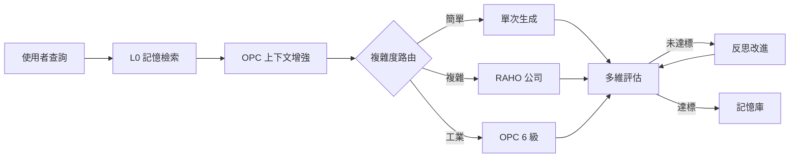

<div align="center">

# 靈境·Linkin

**EvoLoop 運行時 × 世界觀 × 監控中心**

本倉庫基於 [EvoLoop](https://github.com/iiooiioo888/Evoloop)（MIT）衍生，保留自我反思閉環、多代理人公司與工業 OPC，並整合靈境世界觀與監控中心。

[](https://www.python.org/)
[](https://fastapi.tiangolo.com/)
[](https://github.com/langchain-ai/langgraph)
[](https://react.dev/)
[](backend/tests/)
[](LICENSE)

**倉庫：** [iiooiioo888/Linkin](https://github.com/iiooiioo888/Linkin) · **上游：** [EvoLoop](https://github.com/iiooiioo888/Evoloop)  
**線上預覽：** [iiooiioo888.github.io/Linkin](https://iiooiioo888.github.io/Linkin/)（靜態 UI；聊天／寫入需本地或 Docker）

> 單一主線 · 僅 `master` · 文件對齊：2026-09-09

</div>

---

## 新人從這裡開始

| 你是… | 先讀 |
|--------|------|
| 第一次打開倉庫 | [新人導覽](docs/onboarding.md) → [目錄地圖](docs/structure.md) → [角色介紹](docs/company/roles.md) → [快速開始](#-快速開始) |
| 要改後端／前端 | [開發指南](docs/development/guide.md) · [貢獻指南](CONTRIBUTING.md) |
| 要查 API／環境變數 | [REST API](docs/api/reference.md) · [配置參考](docs/config/reference.md) |
| 術語／埠號搞混 | [術語表](docs/glossary.md) |
| Agent／自動化協作 | [AGENTS.md](AGENTS.md) |
| 卡住了 | [常見問題](docs/faq.md) |

完整知識庫索引：[docs/README.md](docs/README.md)

---

## 這是什麼？

統一模式 AI 系統：反思閉環、公司運行時、OPC 工業整合走**同一條** LangGraph 管線，由 `route_by_complexity` 依任務自動選路。

| 能力 | 說明 |
|:---:|------|
| 反思閉環 | 4 維評分，低於門檻自動反思改進 |
| 公司運行時 | 複雜任務觸發 **RAHO**（L5→L4→L3→L2；L1 憲兵；L0 注入） |
| OPC 整合 | 工業任務走 6 級閉環（感知→…→執行） |
| 監控中心 | 活動欄：對話 · 控制台 · 靈境 · Minecraft · 實驗室 |
| 角色目錄 | **85** 內建席 + 自定義 CRUD |
| 模型池鎖定 | 依已存 API 鎖定可用模型；OpenRouter 等可爬 `/models` |



架構細節：[docs/architecture/overview.md](docs/architecture/overview.md)

---

## 專案結構（精簡）

完整套件表見 **[docs/structure.md](docs/structure.md)**。

```
Linkin/
├── backend/                 # FastAPI + LangGraph（backend/README.md）
│   ├── main.py              # REST / SSE / WebSocket 入口
│   ├── core/                # 圖、節點、LLM、模型池、評估
│   ├── company/             # 多代理人 + raho/ + 量化（85 席）
│   ├── linkin/              # 靈境＋16 席子角色＋Minecraft 護欄
│   ├── hub/ · tools/ · memory/ · services/
│   ├── data/ · scripts/ · tests/
├── opc_service/             # OPC UA + 護欄（opc_service/README.md）
├── frontend/                # React 19 + Vite（預設 :3001）
├── vendor/archify/          # 策略圖 CLI（file: 依賴）
├── docs/                    # 知識庫（唯一詳文來源）
├── AGENTS.md                # Agent 約束
├── CONTRIBUTING.md          # 貢獻流程
├── DESIGN.md                # 前端視覺 Token（非系統設計）
├── docker-compose.yml
└── requirements.txt
```

模組邊界與禁止事項：[AGENTS.md](AGENTS.md) · 新人：[docs/onboarding.md](docs/onboarding.md)

---

## 快速開始

### 環境

| 工具 | 版本 |
|------|------|
| Python | **3.12+**（`pyproject.toml`） |
| Node.js | 20+ |
| Docker | 可選 |

### 安裝與啟動

```powershell
git clone https://github.com/iiooiioo888/Linkin.git
cd Linkin

python -m venv .venv
.venv\Scripts\Activate.ps1
pip install -r requirements.txt

copy .env.example .env
# 編輯 .env：填入 API 金鑰；單一廠商請一併設定 api_base／模型

python backend/scripts/test_llm_connection.py   # 可選
pytest backend/tests/ -q

# 後端 http://localhost:8000
python -m backend.main

# 前端 http://localhost:3001（$env:VITE_DEV_PORT 可覆寫）
cd frontend; npm install; npm run dev

# 示範資料（不呼叫 LLM）
python -m backend.scripts.seed_demo_content
```

### Docker

```powershell
docker compose up -d
docker compose up -d redis chroma   # 僅基礎設施
```

| 服務 | 端口 |
|------|------|
| backend | 8000 |
| frontend | **3001**（本機 Vite／Compose 宿主埠；prod 容器內 nginx 為 80） |
| opc_service | 8001 |
| redis | 6379 |
| chroma | 8100 |

部署細節：[docs/deployment/guide.md](docs/deployment/guide.md) · 環境變數：[docs/config/reference.md](docs/config/reference.md) · 範例：[.env.example](.env.example)

---

## 文件地圖

| 文件 | 內容 |
|------|------|
| [新人導覽](docs/onboarding.md) | 閱讀順序、目錄心智模型、第一個 PR |
| [目錄地圖](docs/structure.md) | 套件／路徑單一來源 |
| [術語表](docs/glossary.md) | RAHO／L0–L5／埠號速查 |
| [知識庫索引](docs/README.md) | 全部文件目錄 |
| [架構總覽](docs/architecture/overview.md) | 統一管線、資料流 |
| [反思閉環](docs/architecture/reflection-loop.md) | 評分／反思／快取 |
| [公司運行時](docs/architecture/company-runtime.md) | RAHO、角色、預算 |
| [角色介紹](docs/company/roles.md) | 85 席＋16 靈境＋8 模板 |
| [OPC 整合](docs/architecture/opc-integration.md) | 6 級閉環、護欄 |
| [AI Hub 設計](docs/AI_HUB_DETAILED_DESIGN.md) | Hub 契約（探針／熔斷／目錄） |
| [量化工具](docs/company/quant-tools.md) | 行情／回測／組合 |
| [靈境](docs/linkin/worldview.md) · [Minecraft MCP](docs/linkin/minecraft-mcp.md) | 世界觀與遊戲橋接 |
| [REST API](docs/api/reference.md) | 端點、SSE |
| [配置參考](docs/config/reference.md) | 環境變數、模型池、RAHO |
| [開發指南](docs/development/guide.md) | 結構、測試、擴展點 |
| [貢獻指南](CONTRIBUTING.md) | 分支、測試、PR 檢查 |
| [常見問題](docs/faq.md) | 測試／模型池／記憶／Pages |
| [前端](frontend/README.md) | Vite 開發入口 |

根目錄 `DEPLOYMENT.md` 僅為捷徑，正式內容在 `docs/deployment/guide.md`。  
根目錄 `DESIGN.md` 是 Linear 風格**前端視覺 Token**，系統架構請看 `docs/architecture/`。

---

## 關鍵約束（必讀）

1. LLM 一律經 `backend.core.llm.call_llm`（LiteLLM），禁止直連供應商 SDK  
2. 測試用 `monkeypatch` 隔離外部依賴，無需真實 API 金鑰  
3. 禁止直接改編譯後的 LangGraph 圖；改 `build_graph()` 與節點  
4. OPC 寫入必須經 `opc_service/guard.py`  
5. Minecraft 寫入必須經 `backend/tools/minecraft_mcp.py` 與 `backend/linkin/minecraft.py`；禁止暴露檔案系統工具給角色  

詳見 [AGENTS.md](AGENTS.md) · [貢獻指南](CONTRIBUTING.md)

---

## 技術棧

| 層 | 技術 |
|----|------|
| 閉環 | LangGraph + LiteLLM |
| 後端 | FastAPI + asyncio |
| 記憶 | ChromaDB · Redis |
| 工業 | OPC UA（asyncua） |
| 前端 | React 19 + Vite + TypeScript · i18next |
| 測試 | pytest（`backend/tests/`） |
| 部署 | Docker Compose + GitHub Pages（`master`） |

---

<div align="center">

[知識庫](docs/README.md) · [新人導覽](docs/onboarding.md) · [API](docs/api/reference.md) · [開發](docs/development/guide.md) · [Demo](https://iiooiioo888.github.io/Linkin/)

</div>
