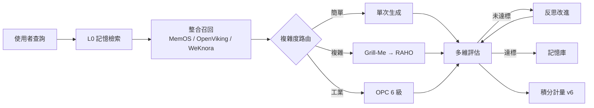

<div align="center">

# 靈境·Linkin

**EvoLoop 運行時 — 具反思閉環的統一 AI 管線、多代理人指揮鏈與監控控制台**

本倉庫基於 [EvoLoop](https://github.com/iiooiioo888/Evoloop)（MIT）衍生：反思閉環、RAHO 公司運行時、OPC 工業整合與靈境世界觀走**同一條** LangGraph 管線。

[](https://github.com/iiooiioo888/Linkin/actions/workflows/test.yml)
[](LICENSE)
[](https://www.python.org/)
[](https://nodejs.org/)
[](https://fastapi.tiangolo.com/)
[](https://github.com/langchain-ai/langgraph)
[](https://react.dev/)

**Repo:** [iiooiioo888/Linkin](https://github.com/iiooiioo888/Linkin) · **Upstream:** [EvoLoop](https://github.com/iiooiioo888/Evoloop)  
**Static preview:** [iiooiioo888.github.io/Linkin](https://iiooiioo888.github.io/Linkin/)（靜態 UI；聊天／寫入需本地或 Docker 後端）

> 單一主線 · 僅 `master` · 文件對齊：2026-09-11

</div>

---

## 目錄

- [新人從這裡開始](#新人從這裡開始)
- [核心能力](#核心能力)
- [架構概覽](#架構概覽)
- [專案結構](#專案結構)
- [快速開始](#快速開始)
- [部署](#部署)
- [Agent skills](#agent-skills)
- [文件地圖](#文件地圖)
- [關鍵約束](#關鍵約束必讀)
- [技術棧](#技術棧)

---

## 新人從這裡開始

| 你是… | 先讀 |
|--------|------|
| 第一次打開倉庫 | [新人導覽](docs/onboarding.md) → [目錄地圖](docs/structure.md) → [角色介紹](docs/company/roles.md) → [快速開始](#快速開始) |
| 要改後端／前端 | [開發指南](docs/development/guide.md) · [貢獻指南](CONTRIBUTING.md) |
| 要查 API／環境變數 | [REST API](docs/api/reference.md) · [配置參考](docs/config/reference.md) |
| 術語／埠號搞混 | [術語表](docs/glossary.md) |
| Agent／自動化協作 | [AGENTS.md](AGENTS.md) |
| 卡住了 | [常見問題](docs/faq.md) |

完整知識庫索引：[docs/README.md](docs/README.md)

---

## 核心能力

| 能力 | 說明 |
|------|------|
| **統一 LangGraph 管線** | FastAPI + LangGraph + LiteLLM；`route_by_complexity` 依任務選路（簡單生成／RAHO 公司／OPC 工業） |
| **反思閉環** | 多維評分 → 未達標自動反思改進 → 達標寫入記憶 |
| **RAHO 公司運行時** | L5 用戶 → L4 審計 → L3 戰術 → L2 執行；L1 憲兵審查；L0 記憶注入；**85** 內建席 + 自定義 CRUD |
| **Grill-Me 對話鎖定** | 複雜任務前由 `/raho/grill/*` 與指揮官 grill 反覆釐清需求，鎖定後才進入戰役 |
| **React 監控控制台** | 對話 · 控制台 · 靈境 · Minecraft · 實驗室；Linear 風 dense UI、三欄 ~100vh 版面 |
| **行動版適配** | 768px 以下底部 Tab、safe-area；桌面 ≥1440 三欄控制台 |
| **整合層（顯式召回）** | MemOS · OpenViking · WeKnora · Yao · Ouroboros · OpenPencil — token 節省召回，禁止自動 webhook |
| **積分／計費 v6** | 虛擬積分錢包（非第三方支付）；多池（個人／共享／貢獻／故障）、Docker 按時計費、方案牌價、阿里雲成本唯讀對帳 |
| **AI Hub** | 探針／熔斷／目錄；多 API 路由與模型池鎖定 |
| **OPC 工業** | 獨立微服務 + 寫入護欄；6 級感知→執行閉環 |
| **Minecraft MCP** | MineMCP JSON-RPC + 靈境鐵律；角色經 tool_registry，禁止直連 |

---

## 架構概覽



| 層 | 路徑 | 職責 |
|----|------|------|
| 圖／LLM | `backend/core/` | LangGraph、LiteLLM、模型池、評估 |
| 公司 | `backend/company/` | RAHO、85 席、工作項 DAG、預算 |
| 靈境 | `backend/linkin/` | 憲法、16 席、Minecraft 護欄 |
| 整合 | `backend/integrations/` | 六整合客戶端 + `/integrations` API |
| 計費 | `backend/billing/` | 積分池 v6、Docker 計量、共享池路由 |
| 前端 | `frontend/` | React 19 控制台（詳見 [DESIGN.md](DESIGN.md) 視覺 Token） |
| OPC | `opc_service/` | OPC UA + `guard.py` 護欄 |

詳細架構：[docs/architecture/overview.md](docs/architecture/overview.md)

---

## 專案結構

完整套件表：[docs/structure.md](docs/structure.md)

```
Linkin/
├── backend/                 # FastAPI + LangGraph（backend/README.md）
│   ├── core/ · company/ · linkin/ · billing/ · integrations/
│   ├── hub/ · tools/ · memory/ · services/
│   └── tests/
├── opc_service/             # OPC UA 微服務（opc_service/README.md）
├── frontend/                # React 19 + Vite（預設 :3001）
├── .agents/skills/          # Agent skills（見下方）
├── vendor/archify/          # 策略圖 CLI
├── docs/                    # 知識庫（唯一詳文來源）
├── AGENTS.md · CONTRIBUTING.md · DESIGN.md · DEPLOYMENT.md
├── skills-lock.json         # skills 版本鎖
└── docker-compose.yml
```

模組邊界與禁止事項：[AGENTS.md](AGENTS.md)

---

## 快速開始

### 環境

| 工具 | 版本 |
|------|------|
| Python | **3.12+**（`pyproject.toml`） |
| Node.js | **20+** |
| Docker | 可選（Redis、Chroma、全棧） |

### 本機開發

```bash
git clone https://github.com/iiooiioo888/Linkin.git
cd Linkin

python3 -m venv .venv
source .venv/bin/activate   # Windows: .venv\Scripts\Activate.ps1
pip install -r requirements.txt

cp .env.example .env
# 編輯 .env：填入 API 金鑰；單一廠商請一併設定 api_base／模型

python backend/scripts/test_llm_connection.py   # 可選
pytest backend/tests/ -q

# 後端 http://localhost:8000
python -m backend.main

# 前端 http://localhost:3001
cd frontend && npm install && npm run dev

# 示範資料（不呼叫 LLM）
python -m backend.scripts.seed_demo_content
```

---

## 部署

| 方式 | 說明 |
|------|------|
| **Docker Compose** | `docker compose up -d` — 後端 8000、前端 3001、OPC 8001、Redis 6379、Chroma 8100 |
| **僅基礎設施** | `docker compose up -d redis chroma` |
| **GitHub Pages** | 靜態前端預覽；完整功能需後端 |

| 文件 | 內容 |
|------|------|
| [DEPLOYMENT.md](DEPLOYMENT.md) | 部署捷徑 |
| [docs/deployment/guide.md](docs/deployment/guide.md) | Docker、生產環境、健康檢查 |
| [.env.example](.env.example) | 環境變數範本（勿提交真實金鑰） |
| [docs/config/reference.md](docs/config/reference.md) | 模型池、RAHO、整合開關 |

---

## Agent skills

技能檔位於 `.agents/skills/`（canonical），版本鎖定見 `skills-lock.json`。`npx skills add --all` 產生的各 Agent 目錄副本已列入 `.gitignore`，**僅提交** `.agents/skills/`。

| 來源 | 數量 | 目錄索引 | mcpservers.org |
|------|------|----------|----------------|
| [mattpocock/skills](https://github.com/mattpocock/skills) | 37 | 工程化工作流（TDD、grill、spec→tickets…） | — |
| [anthropics/skills](https://github.com/anthropics/skills) | 20 | 文件（docx/pdf/pptx/xlsx）、前端設計、`mcp-builder`… | [作者頁](https://mcpservers.org/zh-TW/agent-skills/author/anthropic) |
| [openai/skills](https://github.com/openai/skills) | 43 | Codex 技能（Figma、部署、安全、Playwright…） | [作者頁](https://mcpservers.org/zh-TW/agent-skills/author/openai) |
| [scrapegraphai/just-scrape](https://github.com/scrapegraphai/just-scrape) | 1 | `just-scrape`（CLI + `SGAI_API_KEY`） | [作者頁](https://mcpservers.org/zh-TW/agent-skills/author/scrapegraphai) |
| [vercel-labs/agent-browser](https://github.com/vercel-labs/agent-browser) | 1 | `agent-browser` 瀏覽器自動化 CLI | [技能頁](https://mcpservers.org/zh-TW/agent-skills/vercel/agent-browser) |

**共 102 項**（Anthropic/OpenAI 的 `pdf`、`skill-creator` 因名稱衝突分別命名為 `anthropic-pdf` / `openai-pdf` 與 `anthropic-skill-creator` / `openai-skill-creator`）。

**首次設定（每個 clone 一次）：**

```bash
# 還原鎖定版本（推薦）
npx skills@latest experimental_install

# 或重新從上游安裝全部技能包
npx skills@latest add mattpocock/skills --all --copy
npx skills@latest add anthropics/skills --all --copy
npx skills@latest add openai/skills --all --copy
npx skills@latest add scrapegraphai/just-scrape --all --copy
npx skills@latest add vercel-labs/agent-browser --all --copy
# 安裝後請刪除各 Agent 目錄下的 skills 副本，僅保留 .agents/skills/
```

**接著在 Agent 中執行一次 `setup-matt-pocock-skills`**，配置 issue tracker、分類標籤與 domain 文件版面（詳見 `.agents/skills/setup-matt-pocock-skills/SKILL.md`）。

**可選 MCP / CLI：** 多數技能為 skills-only。OpenAI 的 Figma / Linear / Developer Docs 等技能可搭配 MCP；ScrapeGraphAI 與 agent-browser 為 CLI。設定說明與 Cursor 範例片段見 [docs/mcp/agent-skills.md](docs/mcp/agent-skills.md)。

歸功與授權：[mattpocock/skills](https://github.com/mattpocock/skills) · [anthropics/skills](https://github.com/anthropics/skills) · [openai/skills](https://github.com/openai/skills) · [scrapegraphai/just-scrape](https://github.com/scrapegraphai/just-scrape) · [vercel-labs/agent-browser](https://github.com/vercel-labs/agent-browser)

---

## 文件地圖

| 文件 | 內容 |
|------|------|
| [DESIGN.md](DESIGN.md) | Linear 風前端視覺 Token（非系統架構） |
| [DEPLOYMENT.md](DEPLOYMENT.md) | 部署捷徑 → [完整指南](docs/deployment/guide.md) |
| [CONTRIBUTING.md](CONTRIBUTING.md) | 分支、測試、PR 檢查 |
| [新人導覽](docs/onboarding.md) | 閱讀順序、第一個 PR |
| [目錄地圖](docs/structure.md) | 套件／路徑單一來源 |
| [架構總覽](docs/architecture/overview.md) | 統一管線、資料流 |
| [公司運行時](docs/architecture/company-runtime.md) | RAHO、角色、預算 |
| [角色介紹](docs/company/roles.md) | 85 席＋16 靈境 |
| [AI Hub 設計](docs/AI_HUB_DETAILED_DESIGN.md) | Hub 契約 |
| [靈境](docs/linkin/worldview.md) · [Minecraft MCP](docs/linkin/minecraft-mcp.md) | 世界觀與遊戲橋接 |
| [REST API](docs/api/reference.md) | 端點、SSE |
| [前端](frontend/README.md) | Vite 開發入口 |

---

## 關鍵約束（必讀）

1. LLM 一律經 `backend.core.llm.call_llm`（LiteLLM），禁止直連供應商 SDK  
2. 測試用 `monkeypatch` 隔離外部依賴，無需真實 API 金鑰  
3. 禁止直接改編譯後的 LangGraph 圖；改 `build_graph()` 與節點  
4. OPC 寫入必須經 `opc_service/guard.py`  
5. Minecraft 寫入必須經 `backend/tools/minecraft_mcp.py` 與 `backend/linkin/minecraft.py`  

詳見 [AGENTS.md](AGENTS.md) · [CONTRIBUTING.md](CONTRIBUTING.md)

---

## 技術棧

| 層 | 技術 |
|----|------|
| 閉環 | LangGraph + LiteLLM |
| 後端 | FastAPI + asyncio |
| 記憶 | ChromaDB · Redis |
| 工業 | OPC UA（asyncua） |
| 前端 | React 19 + Vite + TypeScript · i18next · Linear dense console |
| 測試 | pytest（`backend/tests/`）· CI：[`.github/workflows/test.yml`](.github/workflows/test.yml) |
| 部署 | Docker Compose + GitHub Pages |

---

<div align="center">

[知識庫](docs/README.md) · [新人導覽](docs/onboarding.md) · [API](docs/api/reference.md) · [Demo](https://iiooiioo888.github.io/Linkin/)

</div>
