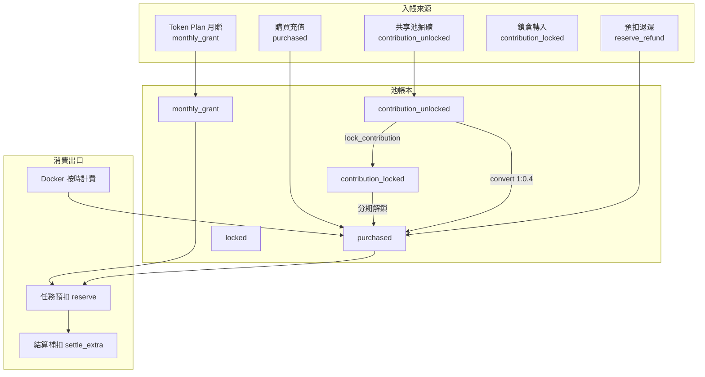
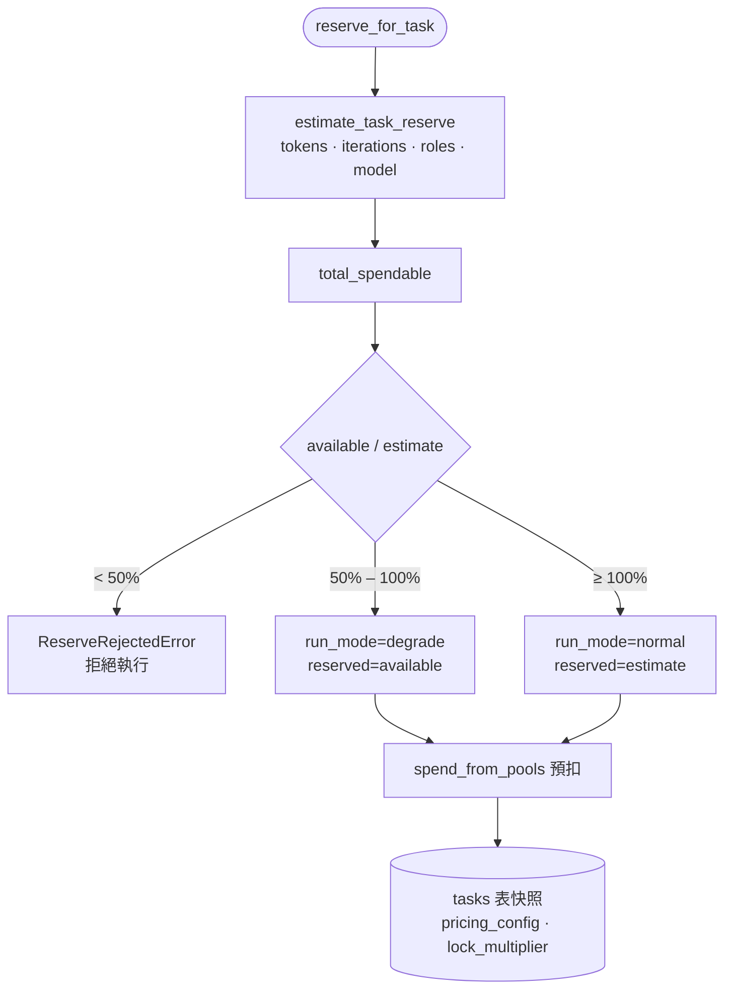
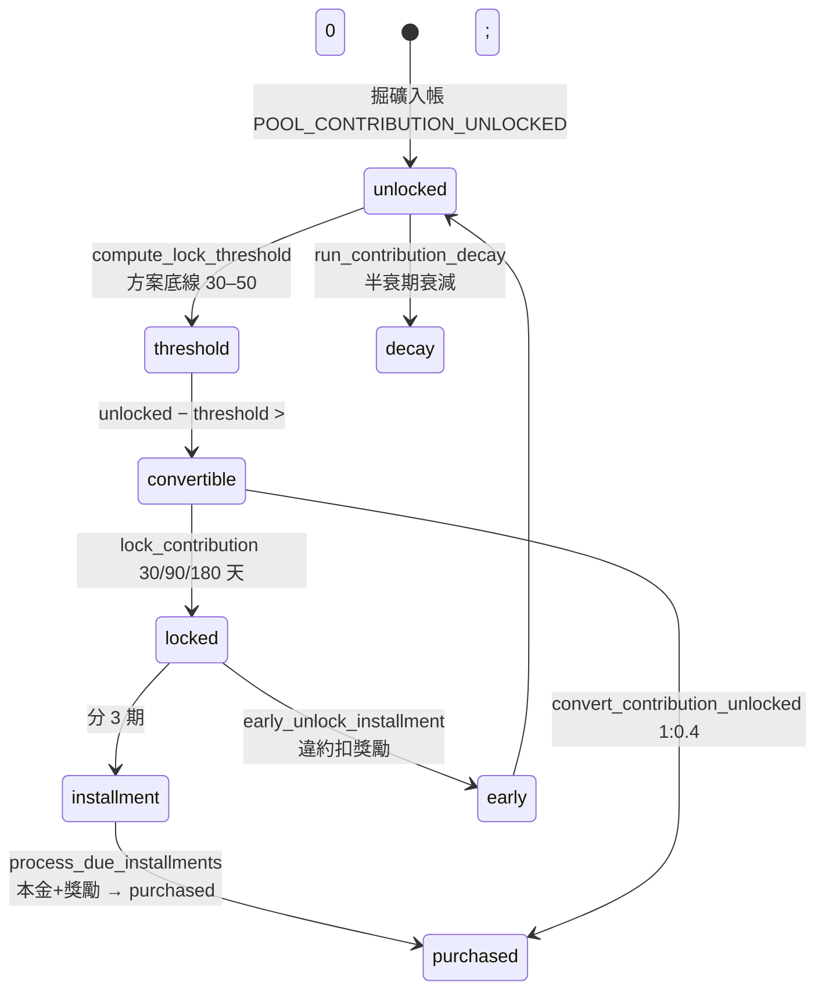
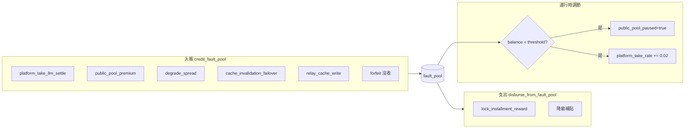
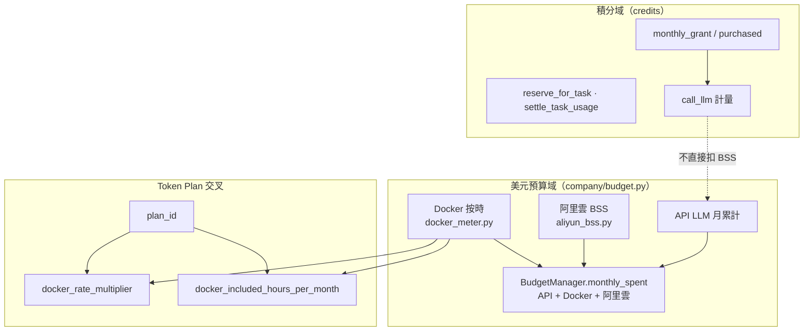

# 積分池生命週期（Credit Pools Lifecycle）

> 對齊日期：**2026-09-12** · 計費模組：**v6.0**  
> 程式入口：`backend/billing/pools_service.py`、`pool_types.py`、`contribution_service.py`、`fault_pool.py`

計費 v6 將使用者資產拆為**多池積分**（不可轉贈、不可提現），任務執行走預扣→結算→退還；貢獻者獎勵與平台抽成分走貢獻池與 Fault Pool。

---

## 1. 池類型與流動

| 池 | 常數 | 可消費 | 可轉出 |
|----|------|--------|--------|
| 月贈 | `POOL_MONTHLY_GRANT` | 是（優先） | 否 |
| 購買 | `POOL_PURCHASED` | 是 | 否 |
| 貢獻未鎖 | `POOL_CONTRIBUTION_UNLOCKED` | 須先轉換 | → purchased（×0.4）或鎖倉 |
| 貢獻鎖定 | `POOL_CONTRIBUTION_LOCKED` | 否（分期解鎖） | → purchased + 獎勵 |
| 鎖定 | `POOL_LOCKED` | 否 | 活動／風控 |

**扣款順序**（`SPEND_ORDER`）：`monthly_grant` → `purchased` only。

---

## 2. 任務預扣分級（Reserve Tiers）

| 分級 | 比率 | `run_mode` | 行為 |
|------|------|------------|------|
| reject | &lt; 50% | — | 拋出 `ReserveRejectedError` |
| degrade | 50%–100% | `degrade` | 以可用餘額預扣；任務可能降級 |
| normal | ≥ 100% | `normal` | 全額預扣 |

結算：`finalize_task` — `reserved − actual` 退至 `purchased`；不足則 `settle_extra` 補扣。

---

## 3. 鎖倉／轉換狀態機

### 動態鎖倉閾值（非固定 50）

`compute_lock_threshold(unlocked, locked, plan_id)`：

| 方案 | 底線 floor |
|------|-----------|
| free | 50 |
| starter | 45 |
| pro | 40 |
| business | 35 |
| enterprise | 30 |

公式：`BASE(30) + min(CAP−floor, lifetime×0.12)`；高鎖倉比例時 ×0.9。

### 鎖倉倍率（`CONTRIBUTION_LOCK_TIERS`）

| 天數 | 倍率 |
|------|------|
| 30 | 1.02 |
| 90 | 1.08 |
| 180 | 1.20 |

分期獎勵優先從 `fault_pool` 撥付（`disburse_for_lock_reward`）；不足則平台補差。

---

## 4. Fault Pool

獨立分類帳，承接平台經濟活動的「系統側」流水。

| 事件 | 函式 | 說明 |
|------|------|------|
| LLM 平台抽成 | `settle_contributor_reward` | 掘礦時 `platform_take` |
| 公共池溢價 | `record_public_pool_premium` | 約 estimate×10% |
| 降級差價 | `record_degrade_spread` | 約 estimate×5% |
| Failover 快取失效 | `record_cache_invalidation` | 約 cost×2% |
| 耗盡告警 | `_maybe_handle_depletion` | 暫停公共池、提高抽成 |

查詢：`GET /billing/fault-pool` → `fault_pool_status()`。

---

## 5. Docker／BSS 邊界

雲資源費用與**積分池 LLM 預扣**分屬不同帳本，但在 **Agent 預算**（USD）層匯聚。

| 邊界 | 積分池 | Docker | BSS |
|------|--------|--------|-----|
| 計量單位 | credits | USD（按容器小時） | USD（CNY→USD 帳單） |
| 扣款池 | `monthly_grant`/`purchased` | `docker_meter` → `purchased` 或帳單 | 僅納入 `BudgetManager` 壓力 |
| 方案影響 | 月贈額、併發 | `docker_rate_multiplier`、含時數 | 無（帳號級帳單） |
| RAHO 階段 0 | — | orchestrator 雲資源預算檢查 | `sync_aliyun_to_budget` |

> **要點**：BSS 不回寫積分池；控制台「雲費用」與「積分中心」並列展示。Docker 超含時數部分依方案倍率計 USD，再換算扣積分（見 `docker_pricing.py`）。

---

## 6. 月度與衰減

| 作業 | 函式 | 說明 |
|------|------|------|
| 月贈滾動 | `run_rollover(month_key)` | 新月份 `monthly_grant` 重置策略 |
| 貢獻衰減 | `run_contribution_decay()` | `CONTRIBUTION_UNLOCKED_DECAY=0.8` 半衰期 |
| 分期到期 | `process_due_installments` | cron／管理 API 觸發 |

---

## 7. 相關文件

- [共享池掘礦](shared-pool-mining.md) — Key 路由與 settle 細節  
- [system-architecture-2026-09.md](system-architecture-2026-09.md) §5 — 計費總覽  
- [config/reference.md](../config/reference.md) — `LINKIN_PLAN_*_CREDITS` 等  

---

*返回：[專圖索引](specials.md)*
