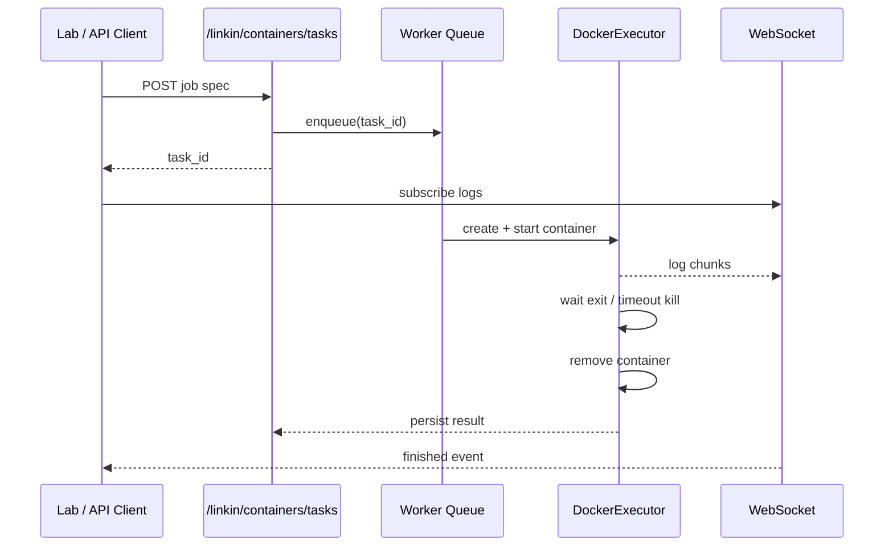

# 任務級臨時容器（Ephemeral Containers）

## 概述

在 Linkin 內提供**單任務、單容器**的隔離執行路徑：提交映像與命令 → 背景 worker 拉起 Docker 容器 → 串流 stdout/stderr → 記錄退出碼 → **自動刪除容器**。  
與 `DockerManager`（管理 Compose 長駐服務）分離；與 EvoLoop `/tasks` LLM 管線並列，供實驗室／監控或日後 L2 工作項調用。

## 流程



## API

| 方法 | 路徑 | 說明 |
| --- | --- | --- |
| GET | `/linkin/containers/config` | 功能開關與映像白名單 |
| POST | `/linkin/containers/tasks` | 建立任務（JSON body） |
| GET | `/linkin/containers/tasks/{id}` | 狀態與結果摘要 |
| GET | `/linkin/containers/tasks/{id}/logs` | 完整日誌（可 `tail`） |
| WS | `/linkin/containers/tasks/{id}/ws` | 快照 + 即時日誌 + `finished` |

### 請求體範例

```json
{
  "image": "python:3.12-slim",
  "command": ["python", "-c", "print('hello')"],
  "timeout_sec": 120,
  "cpu": 0.5,
  "memory_mb": 128,
  "network": false,
  "env": {},
  "workdir": "/workspace"
}
```

硬上限由環境變數控制（見下表）；映像须在白名單內。

## 安全預設

- 非 root（`65534:65534`）
- `read_only` 根檔案系統 + `/tmp` tmpfs
- 預設 `network_mode=none`
- `cap_drop=ALL`、`no-new-privileges`
- CPU / 記憶體 / pids 上限
- 逾時強制 `kill` 並移除容器
- **不**掛載 `docker.sock`；不允許特權容器
- 僅允許白名單映像

## 環境變數

| 變數 | 預設 | 說明 |
| --- | --- | --- |
| `EVOL_EPHEMERAL_CONTAINERS` | 關 | `1` / `true` 啟用 API 與 worker |
| `EVOL_EPHEMERAL_IMAGE_ALLOWLIST` | 內建三映像 | 逗號分隔，如 `python:3.12-slim,node:20-slim` |
| `EVOL_EPHEMERAL_MAX_TIMEOUT_SEC` | `600` | 單任務逾時上限（秒） |
| `EVOL_EPHEMERAL_MAX_MEMORY_MB` | `512` | 記憶體上限 |
| `EVOL_EPHEMERAL_MAX_CPU` | `2` | CPU 上限（核） |
| `EVOL_EPHEMERAL_MAX_PIDS` | `256` | 進程數上限 |
| `EVOL_EPHEMERAL_ARTIFACTS_DIR` | `data/linkin/ephemeral_artifacts` | 日後產物目錄（MVP 以日誌為主） |
| `EVOL_EPHEMERAL_INTEGRATION_DOCKER` | — | 測試用：啟用真 Docker 整合測試 |

HTTP 與 WebSocket 沿用 **Linkin 閘門**（`LINKIN_AUTH_*`）；與其他受保護 API 相同。

## 本機驗證

```bash
export EVOL_EPHEMERAL_CONTAINERS=1
export LINKIN_AUTH_DISABLED=1   # 僅本機開發可選
python -m backend.main

curl -s http://localhost:8000/linkin/containers/config | jq .

curl -s -X POST http://localhost:8000/linkin/containers/tasks \
  -H 'Content-Type: application/json' \
  -d '{"image":"python:3.12-slim","command":["python","-c","print(42)"]}' | jq .

# 將上一步 task_id 代入
curl -s http://localhost:8000/linkin/containers/tasks/<task_id>/logs
```

前端：**監控中心 → 實驗室 → 容器** 分頁可提交任務並看 WebSocket 日誌。

## 測試

```bash
pytest backend/tests/test_ephemeral_containers.py
# 本機 Docker（可選）
EVOL_EPHEMERAL_INTEGRATION_DOCKER=1 pytest backend/tests/test_ephemeral_containers.py -k integration
```

CI 使用假 Docker 客戶端；無 daemon 時仍可通過單元測試。

## 與現有 Docker 計費的關係

`record_docker_runtime` / `docker_billing_loop` 針對 **Compose 項目長駐服務**。臨時容器帶 `linkin.ephemeral.managed` 標籤，**不**納入 Compose 項目清單；後續可單獨按任務時長計費。
