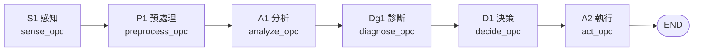
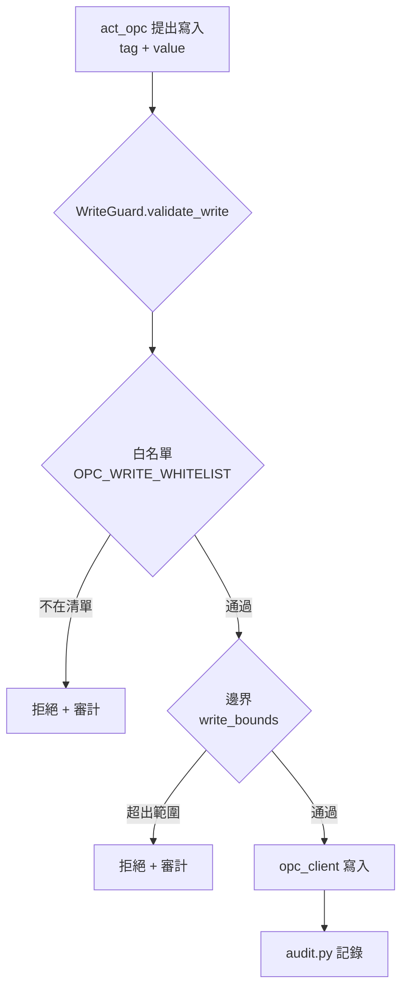
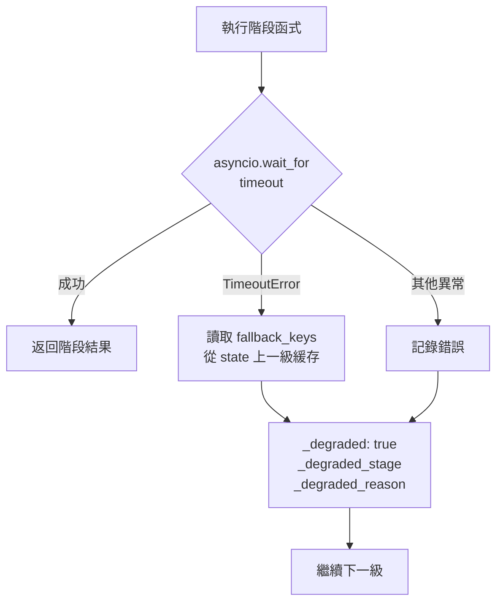
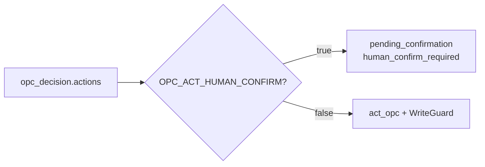

# OPC 六級工業閉環

> 對齊日期：**2026-09-12** · 套件：`opc_service/`  
> 程式入口：`opc_service/graph.py`、`guard.py`、`sense`…`act` 各級節點

OPC 整合將工業感測與控制嵌入 EvoLoop **統一管線**：完整六級閉環在 `opc_service` 獨立編圖；主圖僅在工業關鍵詞命中時注入 **S1 感知摘要**（`enhance_with_opc_context`）。

---

## 1. 六級流程 S1 → A2



| 階段 | 代號 | 職責 | 主要輸出鍵 |
|------|------|------|-----------|
| S1 | 感知 | 讀取 OPC UA 標籤原始值 | `opc_readings` |
| P1 | 預處理 | 清洗、品質過濾、標準化 | `opc_readings_clean` |
| A1 | 分析 | 統計、閾值違規、趨勢 | `opc_analysis` |
| Dg1 | 診斷 | LLM 根因、異常解釋 | `opc_diagnosis` |
| D1 | 決策 | 控制策略、優先級、風險 | `opc_decision` |
| A2 | 執行 | 寫入控制（經護欄）、驗證 | `opc_act_result` |

獨立圖：`build_opc_graph()` → `opc_graph`（`opc_service/graph.py`）。

---

## 2. 主圖（LangGraph）銜接

主圖**不**整段嵌入六級子圖，而是在記憶檢索後做**上下文增強**：

```mermaid
flowchart TD
    START([START]) --> RM[retrieve_memories]
    RM --> OPC_CTX["enhance_with_opc_context<br/>backend/core/company_nodes.py"]
    OPC_CTX --> LINKIN[enhance_with_linkin_context]
    LINKIN --> RECALL[enhance_with_recall_context]
    RECALL --> ROUTE{route_by_complexity}

    OPC_CTX -.->|工業關鍵詞命中| S1_LITE["sense_opc 摘要<br/>注入 opc_context.summary"]
    OPC_CTX -.->|無關鍵詞／服務不可用| SKIP[opc_context={} 靜默降級]
```

### 觸發關鍵詞（`_OPC_KEYWORDS`）

- 中文：感測、溫度、壓力、流量、閥門、馬達、設備、製程、工業、產線…
- 英文：opc、sensor、temperature、pressure、flow、valve、motor、industrial、plc…

### 降級策略

| 情況 | 行為 |
|------|------|
| 無工業關鍵詞 | 跳過，不呼叫 OPC |
| `asyncio` 已有事件迴圈 | 跳過非同步感知（避免嵌套） |
| `opc_service` 不可用 | `logger.warning` 後返回空上下文 |
| 讀數為空 | 不注入摘要 |

完整六級閉環由 `opc_service` REST／WebSocket 或任務管線單獨觸發；詳見 [opc-integration.md](opc-integration.md)。

---

## 3. WriteGuard（寫入護欄）

**所有 A2 寫入必經** `opc_service/guard.py` 的 `WriteGuard`；禁止繞過護欄直寫 OPC UA。



| 檢查 | 方法 | 說明 |
|------|------|------|
| 白名單 | `check_whitelist(tag)` | 標籤須匹配 `settings.write_whitelist` 前缀；空清單=不限制 |
| 邊界 | `check_bounds(tag, value)` | 依 `write_bounds` 鍵名匹配範圍 |
| 綜合 | `validate_write(tag, value)` | 兩者皆過才允許 |

模組單例：`write_guard = WriteGuard()`。

---

## 4. 超時降級

每級包裝為 `*_opc_safe`，內部 `_with_timeout_and_fallback`（預設 `OPC_STAGE_TIMEOUT=30` 秒）。



降級標記範例：

```json
{
  "_degraded": true,
  "_degraded_stage": "analyze",
  "_degraded_reason": "analyze 超時（30s）"
}
```

### A2 人工確認（可選）

`OPC_ACT_HUMAN_CONFIRM=true` 時，決策動作不自動執行，改標記 `pending_confirmation`：



---

## 5. 雙協議與埠號

| 協議 | 用途 | 典型端點 |
|------|------|----------|
| **REST** | 單次讀／寫、健康探針 | `opc_service` HTTP API |
| **WebSocket** | 標籤訂閱、即時推播 | 感測值變化串流 |

| 環境 | OPC 埠 | 說明 |
|------|--------|------|
| 本機／Compose 開發 | **8001** | `docker-compose.yml` 預設 |
| 生產（香港 ECS） | **18000** | 與 FastAPI `8000` 錯開映射 |
| 模擬器 | — | `OPC_SIM_ENABLED=true` 內建感測資料 |

模擬標籤：Temperature、Pressure、FlowRate、ValvePosition、MotorSpeed 等（見 [opc-integration.md](opc-integration.md)）。

---

## 6. 環境變數速查

| 變數 | 預設 | 說明 |
|------|------|------|
| `OPC_SIM_ENABLED` | `false` | 啟用模擬 OPC 伺服器 |
| `OPC_WRITE_WHITELIST` | — | 寫入白名單（逗號分隔） |
| `OPC_STAGE_TIMEOUT` | `30` | 每級超時（秒） |
| `OPC_ACT_HUMAN_CONFIRM` | `false` | A2 人工確認 |

---

## 7. 相關文件

- [opc-integration.md](opc-integration.md) — 觸發條件與模擬器  
- [system-architecture-2026-09.md](system-architecture-2026-09.md) — 部署拓撲與主圖  
- [opc_service/README.md](../../opc_service/README.md) — 套件開發入口  

---

*返回：[專圖索引](specials.md)*
