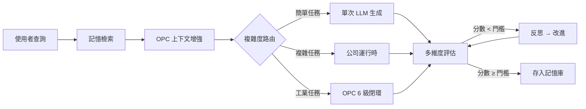

# 架構總覽

> 對齊日期：2026-09-09 · 倉庫產品名：**靈境·Linkin**（EvoLoop 運行時）

> **全景文檔**：部署、分層、LangGraph、RAHO、計費 v6、對話與前端殼的完整圖解見 **[系統架構與運作流程（全面·2026-09）](system-architecture-2026-09.md)**。

Linkin／EvoLoop 是一個**統一模式** AI 系統，所有任務進入同一條管線，由系統自動判斷執行策略。

## 核心理念

```
生成 → 評估 → 反思 → 優化 → 永不停止進化
```

不是被動回答問題，而是**主動反思、迭代改進**，直到品質達標。

## 三層能力

```
┌─────────────────────────────────────────────────────────────┐
│                    統一管線 (LangGraph)                      │
│                                                             │
│  ┌──────────────┐  ┌──────────────┐  ┌──────────────┐      │
│  │  反思閉環     │  │  公司運行時   │  │  OPC 整合    │      │
│  │              │  │              │  │              │      │
│  │  generate    │  │  raho L5–L1  │  │  sense       │      │
│  │  evaluate    │  │  decomposer  │  │  preprocess  │      │
│  │  reflect     │  │  reviewer    │  │  analyze     │      │
│  │  improve     │  │  synthesizer │  │  diagnose    │      │
│  │              │  │  budget      │  │  decide/act  │      │
│  └──────────────┘  └──────────────┘  └──────────────┘      │
│                                                             │
│  ┌──────────────────────────────────────────────────────┐  │
│  │  基礎設施：TaskManager · Archiver · TraceLogger      │  │
│  │           EventBus · StateStore · VectorMemory       │  │
│  └──────────────────────────────────────────────────────┘  │
└─────────────────────────────────────────────────────────────┘
```

| 層級 | 觸發條件 | 流程 |
|------|----------|------|
| **反思閉環** | 所有任務 | 生成 → 評估(0-10) → 反思 → 改進 → 迴圈直到達標 |
| **公司運行時** | 複雜任務 | L5 Grill-Me → L4 戰役 DAG → L3 原子拆解 → L2 執行 → L1 憲兵簽核 → 審查 → 整合 |
| **OPC 整合** | 工業任務 | 感知 → 預處理 → 分析 → 診斷 → 決策 → 執行 |

## 統一管線流程



## 技術棧

| 層級 | 技術 | 用途 |
|------|------|------|
| 核心閉環 | LangGraph + LiteLLM | 反思迴圈圖 + 多模型路由 |
| 後端 | FastAPI + uvicorn | REST API 服務 |
| 公司運行時 | 自研 (company/) | 多代理人協調 · 預算管控 |
| 向量資料庫 | ChromaDB | 記憶存儲與相似檢索 |
| 快取 | Redis | 任務持久化 · 會話狀態 |
| 工業協議 | OPC UA (asyncua) | 工業數據讀寫與訂閱 |
| 靈境世界觀 | `backend/linkin/` | 憲法、工具鐵律、RAG 四庫；**16** 席靈境子角色（另：公司 `STANDARD_ROLES` **85** 席） |
| 前端 | React 19 + Vite + TypeScript | IDE 風格 UI · Tailwind CSS v4 |
| 測試 | pytest + pytest-asyncio | Mock 隔離 LLM／Chroma／OPC |
| 部署 | Docker Compose | Backend、Frontend、Redis、Chroma、OPC、Nginx |

## 數據流

```
使用者 → FastAPI → LangGraph 圖
                      ↓
              ┌───────┼───────┐
              ↓       ↓       ↓
          簡單任務  公司任務  OPC 任務
              ↓       ↓       ↓
              └───────┼───────┘
                      ↓
              評估 → 反思 → 改進（迴圈）
                      ↓
              決定最終回答 → 存入記憶 → 存檔
                      ↓
              FastAPI → 使用者
```

## 目錄結構

完整套件表與維護規則見 **[目錄地圖](../structure.md)**。精簡樹：

```
Linkin/
├── backend/                     # FastAPI + LangGraph（見 backend/README.md）
│   ├── main.py                  #   REST / SSE / WebSocket 入口
│   ├── auth/ · middleware/ · environment/ · prompts/
│   ├── core/                    #   圖、節點、LLM、評估、模型池
│   │   ├── graph.py             #     build_graph()、複雜度路由
│   │   ├── nodes.py / company_nodes.py
│   │   ├── llm.py               #     call_llm（唯一 LLM 出口）
│   │   ├── provider_pool.py     #     模型池鎖定
│   │   └── evaluation.py        #     多維評估
│   ├── company/                 #   多代理人 + raho/ + 量化（85 席）
│   ├── linkin/                  #   靈境／Minecraft 護欄（16 席子角色）
│   ├── modules/                 #   可插拔世界模組目錄與閘道（GET /modules、/{id}/api/*）
│   ├── tools/ · hub/ · memory/ · services/
│   ├── config/                  #   執行期 JSON（價卡等）
│   ├── data/ · scripts/
│   └── tests/                   #   pytest（約 639 筆收錄）
├── opc_service/                 # OPC UA + guard（見 opc_service/README.md）
├── frontend/                    # React 19 + Vite（預設 :3001）
├── vendor/archify/              # 策略圖 CLI
├── docs/                        # 知識庫（詳文唯一來源）
└── docker-compose.yml
```

新人導覽：[docs/onboarding.md](../onboarding.md) · 知識庫索引：[docs/README.md](../README.md) · 目錄地圖：[structure.md](../structure.md)
