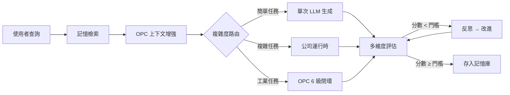

# 架構總覽

EvoLoop 是一個**統一模式** AI 系統，所有任務進入同一條管線，由系統自動判斷執行策略。

## 核心理念

```
生成 → 評估 → 反思 → 優化 → 永不停止進化
```

不是被動回答問題，而是**主動反思、迭代改進**，直到品質達標。

## 三層能力

```
┌─────────────────────────────────────────────────────────────┐
│                    統一管線 (LangGraph)                      │
│                                                             │
│  ┌──────────────┐  ┌──────────────┐  ┌──────────────┐      │
│  │  反思閉環     │  │  公司運行時   │  │  OPC 整合    │      │
│  │              │  │              │  │              │      │
│  │  generate    │  │  raho L5–L1  │  │  sense       │      │
│  │  evaluate    │  │  decomposer  │  │  preprocess  │      │
│  │  reflect     │  │  reviewer    │  │  analyze     │      │
│  │  improve     │  │  synthesizer │  │  diagnose    │      │
│  │              │  │  budget      │  │  decide/act  │      │
│  └──────────────┘  └──────────────┘  └──────────────┘      │
│                                                             │
│  ┌──────────────────────────────────────────────────────┐  │
│  │  基礎設施：TaskManager · Archiver · TraceLogger      │  │
│  │           EventBus · StateStore · VectorMemory       │  │
│  └──────────────────────────────────────────────────────┘  │
└─────────────────────────────────────────────────────────────┘
```

| 層級 | 觸發條件 | 流程 |
|------|----------|------|
| **反思閉環** | 所有任務 | 生成 → 評估(0-10) → 反思 → 改進 → 迴圈直到達標 |
| **公司運行時** | 複雜任務 | L5 Grill-Me → L4 戰役 DAG → L3 原子拆解 → L2 執行 → L1 憲兵簽核 → 審查 → 整合 |
| **OPC 整合** | 工業任務 | 感知 → 預處理 → 分析 → 診斷 → 決策 → 執行 |

## 統一管線流程



## 技術棧

| 層級 | 技術 | 用途 |
|------|------|------|
| 核心閉環 | LangGraph + LiteLLM | 反思迴圈圖 + 多模型路由 |
| 後端 | FastAPI + uvicorn | REST API 服務 |
| 公司運行時 | 自研 (company/) | 多代理人協調 · 預算管控 |
| 向量資料庫 | ChromaDB | 記憶存儲與相似檢索 |
| 快取 | Redis | 任務持久化 · 會話狀態 |
| 工業協議 | OPC UA (asyncua) | 工業數據讀寫與訂閱 |
| 靈境世界觀 | `backend/linkin/` | 憲法、工具鐵律、RAG 四庫、16 席子角色 |
| 前端 | React 18 + Vite + TypeScript | IDE 風格 UI · Tailwind CSS v4 |
| 測試 | pytest + pytest-asyncio | Mock 隔離 LLM／Chroma／OPC |
| 部署 | Docker Compose | Backend、Frontend、Redis、Chroma、OPC、Nginx |

## 數據流

```
使用者 → FastAPI → LangGraph 圖
                      ↓
              ┌───────┼───────┐
              ↓       ↓       ↓
          簡單任務  公司任務  OPC 任務
              ↓       ↓       ↓
              └───────┼───────┘
                      ↓
              評估 → 反思 → 改進（迴圈）
                      ↓
              決定最終回答 → 存入記憶 → 存檔
                      ↓
              FastAPI → 使用者
```

## 目錄結構

```
evoloop/
├── backend/                     # FastAPI 後端 + LangGraph 核心
│   ├── core/                    #   圖定義、狀態、LLM 調用層
│   │   ├── graph.py             #     統一模式圖（複雜度路由 + 反思迴圈）
│   │   ├── nodes.py             #     核心節點（生成/評估/反思/改進）
│   │   ├── company_nodes.py     #     公司運行時節點
│   │   ├── evaluation.py        #     多維度評估引擎
│   │   ├── llm_cache.py         #     LLM 語義快取
│   │   ├── llm.py               #     LiteLLM 統一調用層
│   │   └── state.py             #     EvoLoopState 狀態模型
│   ├── company/                 #   多代理人公司運行時
│   │   ├── orchestrator.py      #     公司協調器
│   │   ├── decomposer.py        #     任務拆分器
│   │   ├── budget.py            #     預算控制 + 模型路由
│   │   ├── work_item.py         #     工作項狀態機 + 依賴 DAG
│   │   ├── roles.py             #     角色定義 + 組織模板
│   │   └── events.py            #     EventBus 生命週期事件
│   ├── memory/                  #   向量記憶庫 (ChromaDB)
│   ├── services/                #   營運服務
│   │   ├── state_store.py       #     統一狀態存儲接口
│   │   ├── task_manager.py      #     後台任務管理器
│   │   ├── trace_logger.py      #     執行軌跡記錄器
│   │   └── archiver.py          #     文本化存檔 (JSONL)
│   ├── config/                  #   配置文件
│   │   └── model_costs.json     #     模型價格表
│   ├── prompts/                 #   Prompt 模板
│   └── tests/                   #   185+ 測試案例
├── opc_service/                 # OPC UA 工業微服務
│   ├── graph.py                 #   6 級閉環圖（帶超時降級）
│   ├── guard.py                 #   安全護欄
│   └── simulator/               #   模擬 OPC 伺服器
├── frontend/                    # React + Vite + TypeScript
│   └── src/
│       ├── components/          #   UI 組件（IDE 風格佈局）
│       ├── api/client.ts        #   API 客戶端
│       └── types.ts             #   TypeScript 型別
└── docker-compose.yml           # 五服務編排
```
