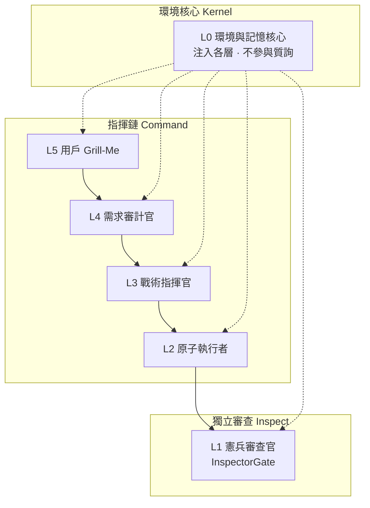
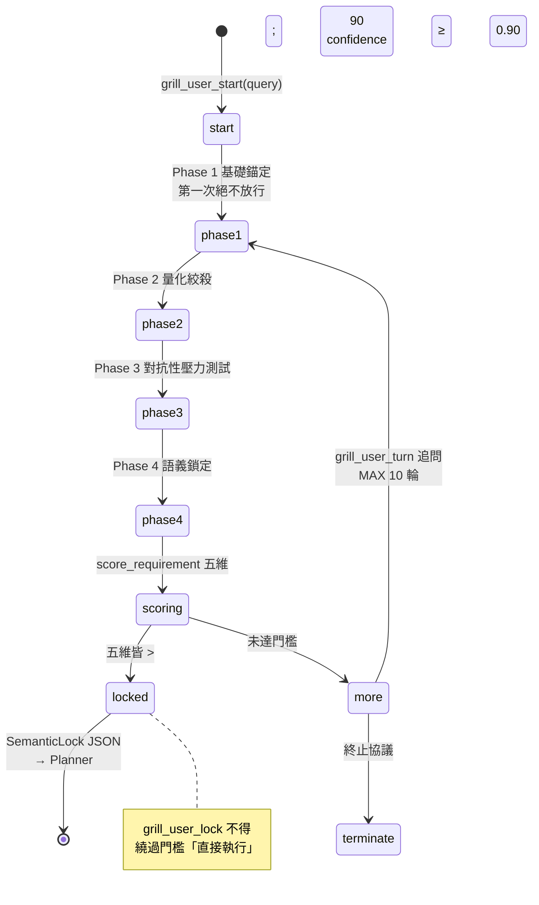
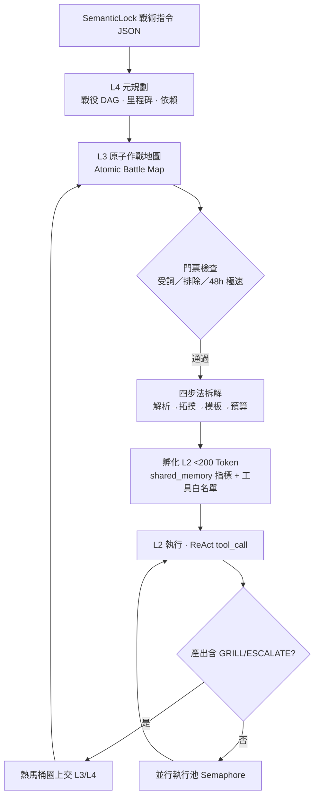
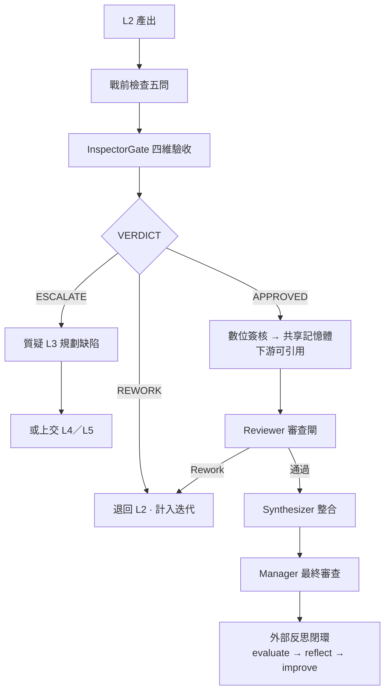
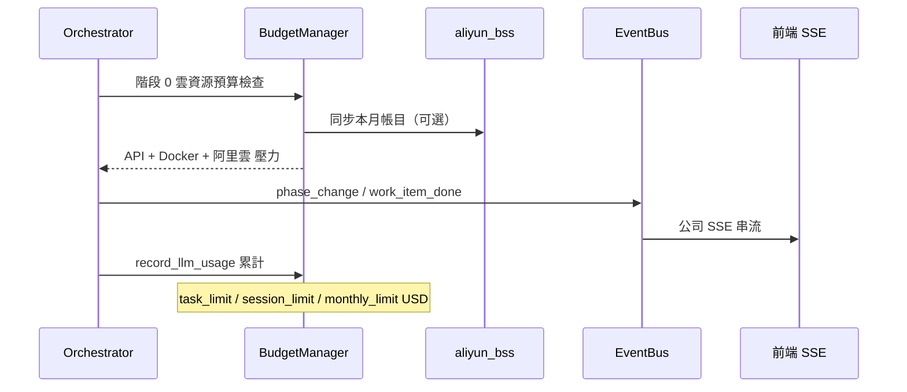

# RAHO / Grill-Me 細節

> 對齊日期：**2026-09-12** · 套件：`backend/company/raho/`、`backend/services/auditor.py`  
> 協議：`backend/company/raho/protocol.py`（三條線：指揮鏈／獨立審查／環境核心）

RAHO（Recursive Adversarial Hierarchical Organization）在複雜任務中疊加於公司運行時：**L5 語意鎖定 → L4 戰役 → L3 原子拆解 → L2 執行 → L1 憲兵 → Reviewer → Synthesizer**。本專圖展開 Grill／Escalate 與預算邊界。

---

## 1. 三條線（非單一金字塔）

| 標記 | 含義 |
|------|------|
| `[GRILL]` | 質詢／追問，要求補資料或重做 |
| `[ESCALATE]` | 上交上一層（含 `[ESCALATE_CHOICE]` 用戶裁定） |
| `[CLEAR]` | 質詢解除 |

---

## 2. L5 Grill-Me 鎖定迴圈

L5 由 **需求審計官**（`backend/services/auditor.py`）實作；`/raho/grill/*` 與 `grill_user.py` 為穩定介面。

### 五維評分（`DIM_KEYS`）

| 維度 | 鍵 | 標籤 |
|------|-----|------|
| 目標具體性 | specificity | 是否可執行、非空泛 |
| 邊界清晰度 | boundary | 範圍／排除項 |
| 約束量化度 | constraints | 預算、時程、資源 |
| 風險感知度 | risk | 備案、降級 |
| 成功定義 | success | 可驗收指標 |

門檻：`AUDITOR_DIM_THRESHOLD = 90`；置信度 `CONFIDENCE_THRESHOLD = 0.90`。  
可關閉：`EVOL_RAHO_USER_GRILL=false`。

---

## 3. L4 → L3 → L2 作戰鏈

語意鎖定後進入公司協調器（`CompanyOrchestrator`）：

### L2 質詢 SOP（`commander.py`）

| 缺口類型 | 動作 |
|----------|------|
| 缺資料 | `[GRILL]` → L4 |
| 缺工具 | `[GRILL]` → L5 用戶 |
| 矛盾 | 裁定或上交 L4 |
| 3 輪無解 | `[ESCALATE]` |
| 硬限制不可行 | 認慫上交 L5，禁止硬拆 |

---

## 4. L1 憲兵收斂

L1 **不隸屬** L3；對交付品質獨立驗收（`inspector.py`）。

### L1 四維驗收

| 鍵 | 標籤 |
|----|------|
| schema_validation | 結構合規性 |
| semantic_integrity | 語義完整性 |
| factual_consistency | 事實一致性 |
| edge_case | 極限邊界檢驗 |

僅 `VERDICT: APPROVED` 的資料可寫入共享記憶體（`blackboard`）。

---

## 5. 事件與預算

| 事件（`CompanyEvent`） | 說明 |
|------------------------|------|
| `phase_change` | RAHO 階段切換 |
| `work_item_done` | L2 工作項完成 |
| `work_item_error` | 執行失敗 |
| `review_rework` | Reviewer 要求重做 |
| `work_item_escalate` | 上交 |
| `grill_raised` / `grill_resolved` | 質詢生命週期 |
| `user_decision_needed` | 需 L5 裁定 |
| `raho_timeout` | 層級逾時 |

預算：`BudgetManager` 總額 = LLM API + Docker 按時 + 阿里雲 BSS（見 [credit-pools-lifecycle.md](credit-pools-lifecycle.md) §5）。

---

## 6. 相關 API 與文件

| 路徑 | 用途 |
|------|------|
| `POST /raho/grill/start` | 開啟 L5 審計 |
| `POST /raho/grill/turn` | 回答追問 |
| `POST /raho/commander/grill` | L2/L3 質詢分類 |
| `POST /chat/stream` | 公司模式 SSE（含 RAHO 事件） |

- [company-runtime.md](company-runtime.md) — 執行流程全文  
- [角色介紹](../company/roles.md) — 85 席 + RAHO 脊柱  
- [system-architecture-2026-09.md](system-architecture-2026-09.md) §4 — RAHO 總覽圖  

---

*返回：[專圖索引](specials.md)*
