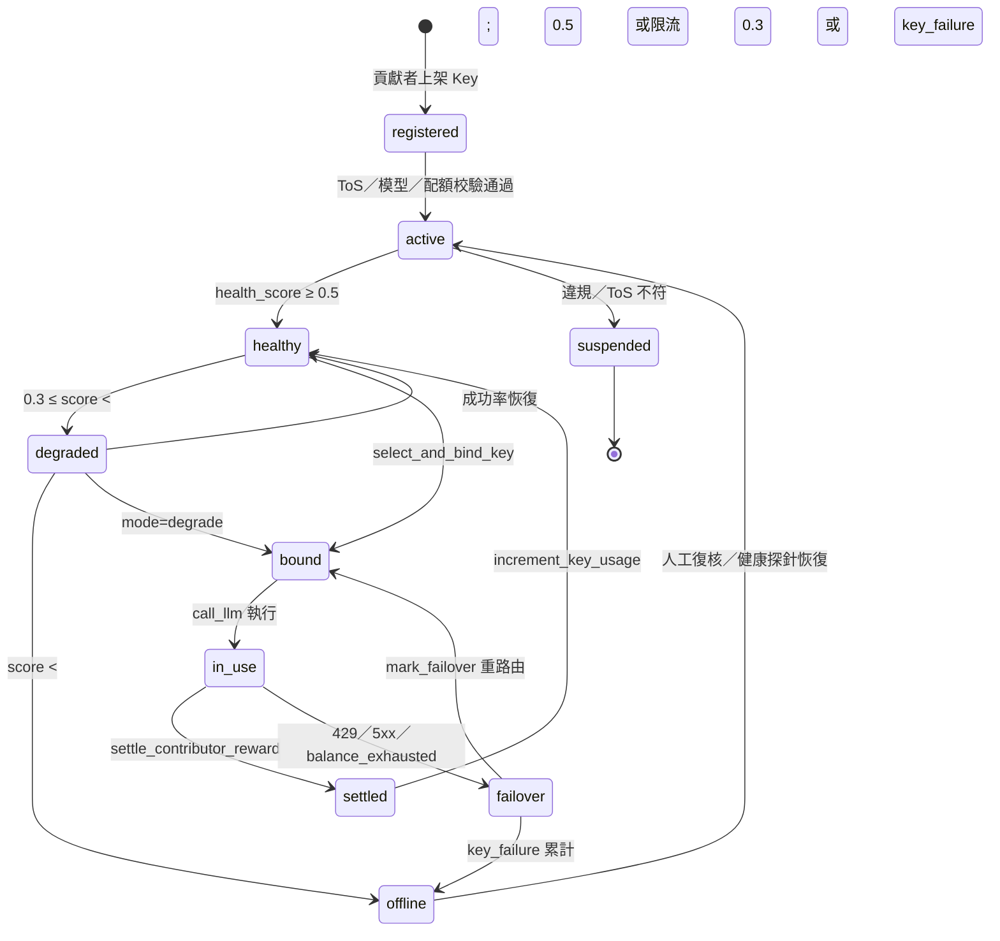
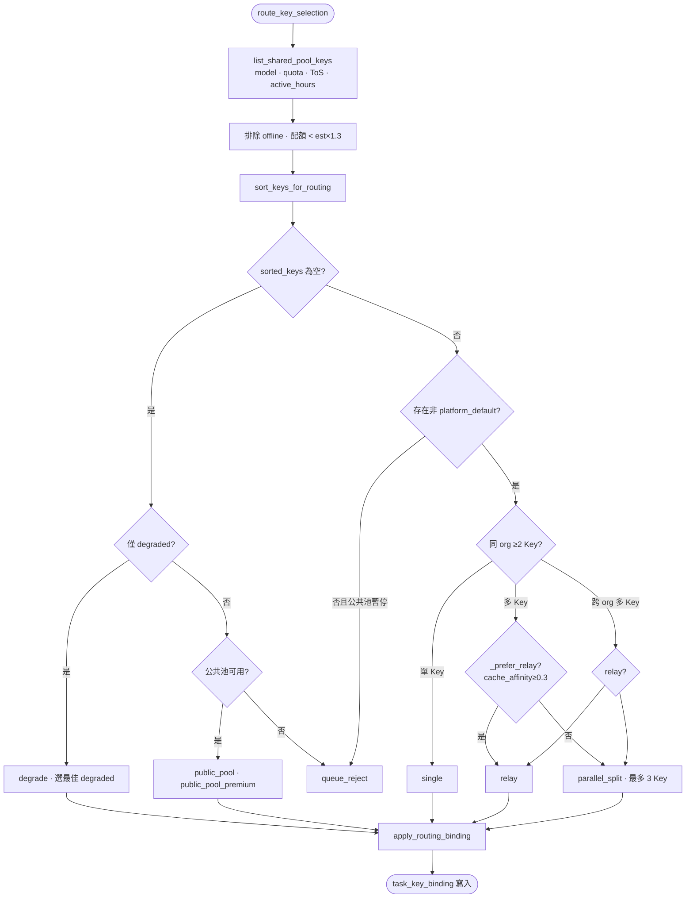
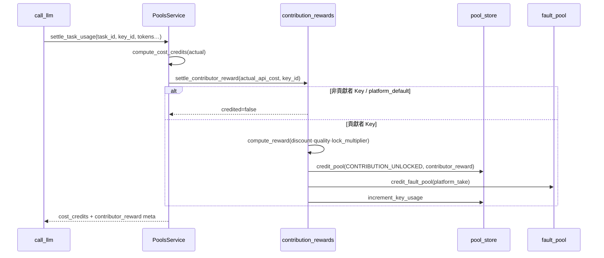
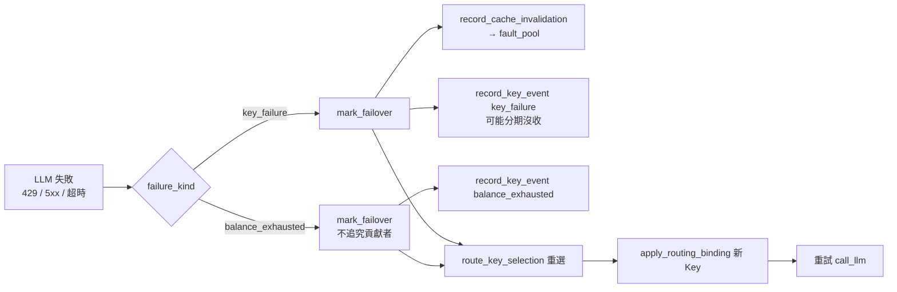

# 共享池掘礦（Shared Pool Mining）

> 對齊日期：**2026-09-12** · 計費模組：**v6.0 Phase 2**  
> 程式入口：`backend/billing/shared_pool.py`、`routing.py`、`key_binding.py`、`contribution_rewards.py`

共享池讓貢獻者將自有 LLM API Key 上架，由平台路由給其他使用者任務；服務完成後，貢獻者獲得 `contribution_unlocked` 積分（掘礦獎勵），平台抽成進入 `fault_pool`。

---

## 1. API Key 生命週期



| 狀態 | 觸發 | 路由影響 |
|------|------|----------|
| `healthy` | 預設；成功率與延遲正常 | 正常參與排序 |
| `degraded` | 限流、延遲偏高 | 僅無健康 Key 時 `mode=degrade` |
| `offline` | `key_failure`、分數過低 | 排除；可能觸發分期沒收 |
| `is_platform_default` | 平台預設 Key | 排序靠後；公共池備援 |

健康評估：`evaluate_key_health()` — 成功率、延遲、限流次數 → `health_score`。

---

## 2. 路由決策樹

與 [system-architecture-2026-09.md](system-architecture-2026-09.md) §5.2 對齊；本節為實作級決策樹。



### 排序鍵（`sort_keys_for_routing`）

優先序（tuple 排序，越小越優先）：

1. 配額 ≥ `estimate × 1.3`
2. 模型匹配
3. `same_org`
4. `cache_affinity`（**貢獻者 Key 常勝過 platform_default 的 0**）
5. `min_price` 低
6. `health_score` 高
7. 併發空槽
8. `routing_weight`（廠商 tier）

> **貢獻者 Key 優先於 `platform_default`**：`platform_default` 帶 `is_platform_default: true`，`cache_affinity=0`；健康貢獻者 Key 在同 org／配額足夠時自然排在前面。

---

## 3. Settle 掘礦（LLM 結算）

每次 `settle_task_usage` 若帶 `key_id` 且為貢獻者 Key，觸發掘礦入帳。



### 獎勵公式（`reward_engine.compute_reward`）

```
gross = actual_api_cost × discount(0.6–0.8) × quality × demand × lock_multiplier
platform_take = gross × platform_take(0.2–0.4)
contributor_reward = gross − platform_take
```

| 輸出池 | 說明 |
|--------|------|
| `POOL_CONTRIBUTION_UNLOCKED` | 貢獻者掘礦獎勵（不可轉贈他人） |
| `fault_pool` | 平台抽成、公共池溢價、降級差價等 |

---

## 4. Failover



| `failure_kind` | 對貢獻者影響 | 快取失效記帳 |
|----------------|-------------|-------------|
| `key_failure` | 健康分下降；可能 `forfeit_installments` | 是（約 cost×2%） |
| `balance_exhausted` | 僅記錄；不沒收 | 否 |

Hub 旁路亦支援多跳 Failover（`failover_hops`），契約見 [AI Hub 詳細設計](../AI_HUB_DETAILED_DESIGN.md)。

---

## 5. Token Plan 綁定

共享池與方案（Token Plan）透過帳戶與功能包交織，而非每把 Key 單獨綁方案。

```mermaid
flowchart TB
    REQ[HTTP 請求] --> AUTH[auth/gate · gate_user]
    AUTH --> BMW[BillingContextMiddleware<br/>billing_user_id]
    BMW --> ACCT[pool_store.ensure_pools(user, plan_id)]
    ACCT --> FEAT{plan_has_feature?}
    FEAT -->|PACK_BYOK / enterprise| CONTRIB[可上架貢獻者 Key]
    FEAT -->|free| NO_BYOK[僅消費共享池／平台 Key]
    CONTRIB --> ROUTE[route_key_selection<br/>org_id 來自 kyc_meta]
    NO_BYOK --> ROUTE
    ROUTE --> RESERVE[reserve_for_task<br/>方案月贈 + purchased 預扣]
```

| 環節 | 模組 | 說明 |
|------|------|------|
| 使用者識別 | `BillingContextMiddleware` | `gate_user` → `billing_user_id` contextvar |
| 方案 | `plans.PLAN_DEFINITIONS` | `free`→`enterprise`；`ensure_pools` 種子月贈 |
| 功能包 | `PACK_BYOK` | 企業版可自帶 Key；貢獻者 API 見 `contributor_api.py` |
| 組織 | `kyc_meta_json.org_id` | 同 org 多 Key → `relay`／`parallel_split` |
| 預扣 | `PoolsService.reserve_for_task` | 與路由估計 `estimate_credits` 聯動 |

方案升級：`POST /billing/plan` → `normalize_plan_id` → 更新 `accounts.plan_id` 與月贈配額。

---

## 6. 相關測試與文件

| 項目 | 位置 |
|------|------|
| 路由／公共池 | `backend/tests/test_billing_phase2.py` |
| 掘礦 settle | `backend/tests/test_billing_contribution_v6.py` |
| Failover | `test_mark_failover_distinguishes_failure_kind` |
| 積分池全貌 | [credit-pools-lifecycle.md](credit-pools-lifecycle.md) |
| 配置 | [config/reference.md](../config/reference.md) |

---

*返回：[專圖索引](specials.md) · [全景架構](system-architecture-2026-09.md)*
