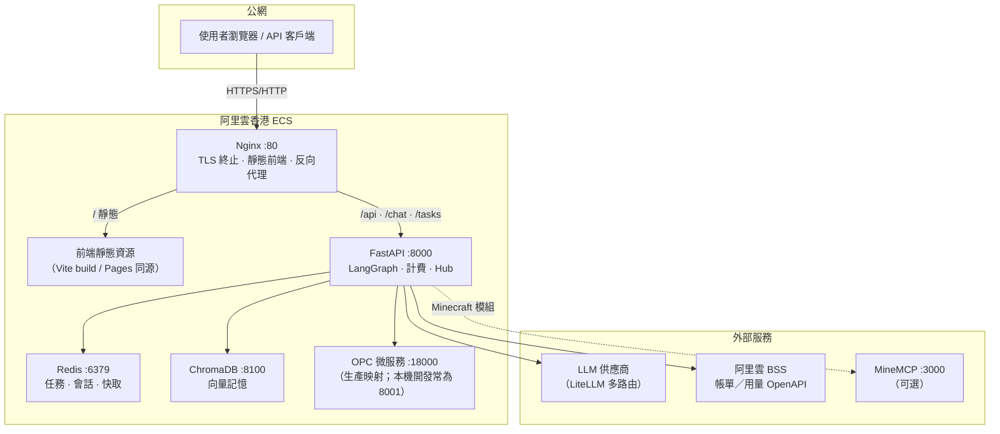
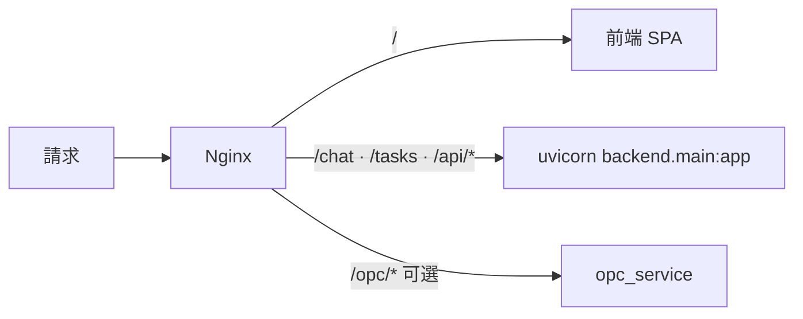
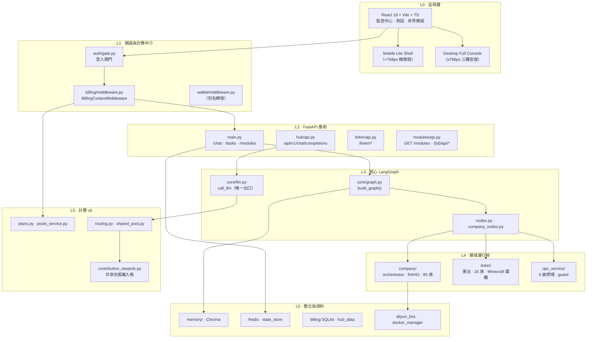
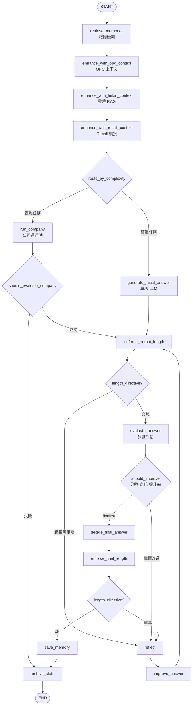
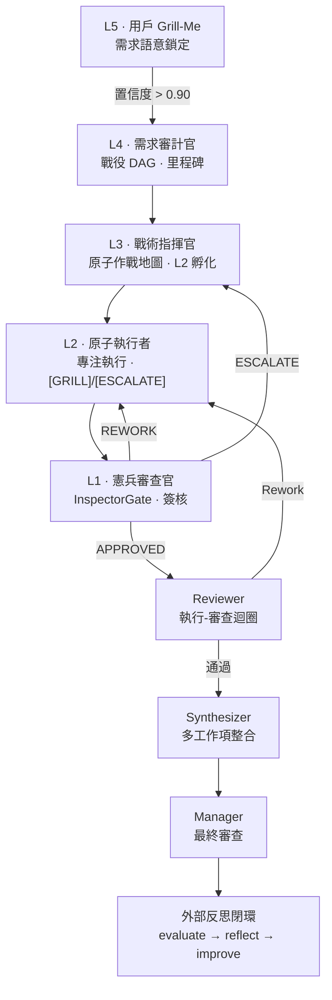
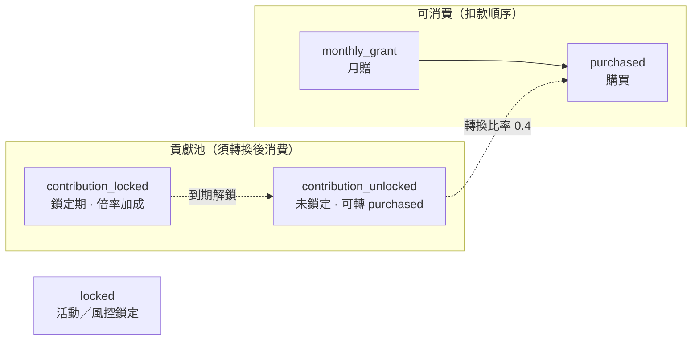
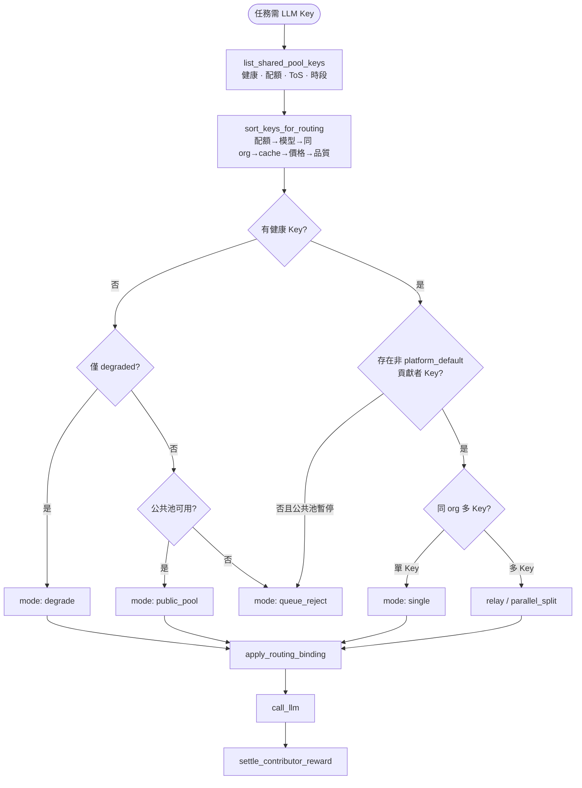
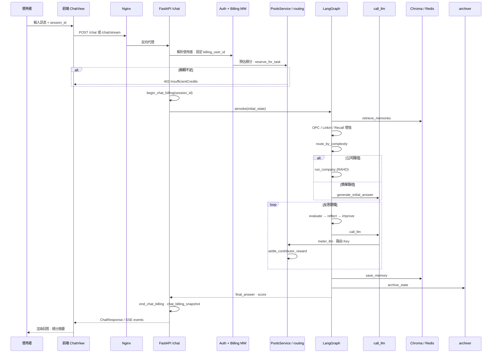
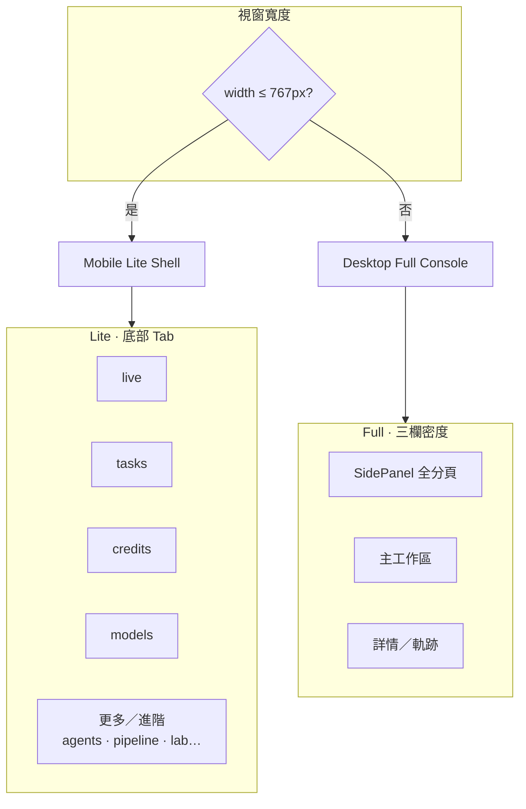
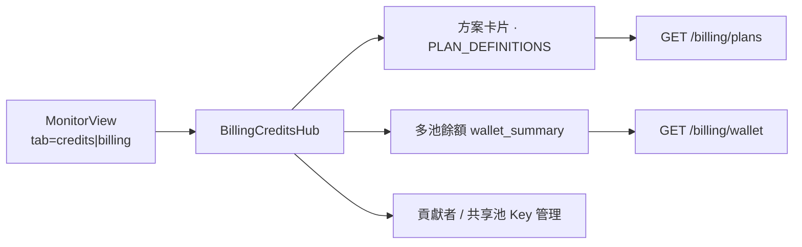

# 系統架構與運作流程（全面·2026-09）

> 對齊日期：**2026-09-12** · 倉庫產品名：**靈境·Linkin**（EvoLoop 運行時）  
> 本文為生產環境對齊的**單篇全景**：部署拓撲、分層、LangGraph 統一管線、RAHO、計費 v6／共享池掘礦、對話生命週期、前端殼。  
> 細部專題仍見同目錄其他文件；本文不重複 API 金鑰或密鑰。

---

## 1. 部署拓撲（生產 · 阿里雲香港 ECS）

生產環境以單台（或小型集群）ECS 為核心，Nginx 作為唯一公網入口，後端與周邊服務在同一 VPC 內互通。

| 元件 | 生產埠／路徑 | 職責 |
|------|-------------|------|
| **Nginx** | `:80`（建議前置 CDN／443） | 靜態前端、反向代理 FastAPI、SSE／WebSocket 長連 |
| **FastAPI** | 內網 `:8000` | REST／SSE／WebSocket；`build_graph()` 統一管線 |
| **Redis** | `:6379` | TaskManager 持久化、會話、計費快取 |
| **ChromaDB** | `:8100` | 向量記憶檢索與寫入 |
| **OPC 微服務** | 生產 **`:18000`** | OPC UA 讀寫；寫入必經 `guard.py` |
| **Token Plan** | 邏輯層（`backend/billing/plans.py`） | 方案權益、月贈積分、併發上限、功能包 |
| **阿里雲 BSS** | OpenAPI（`aliyun_bss.py`） | 雲資源帳單納入 Agent 預算與控制台 |

> **本機／Compose 差異**：開發時前端 `:3001`、OPC 常為 `:8001`、Chroma `:8100`；見 [術語表](../glossary.md) 埠號速查。生產將 OPC 映射至 `18000` 以與後端 `8000` 錯開。

### Nginx 路由示意

---

## 2. 分層架構

系統自外而內分為呈現殼、閘道與計費、應用 API、核心圖、領域運行時、計費 v6、整合與資料層。

| 層級 | 路徑／套件 | 職責摘要 |
|------|-----------|----------|
| 呈現 | `frontend/` | 對話、監控、計費中心、世界模組 UI；Mobile Lite 僅裁切**呈現**，不裁 API |
| 閘道 | `backend/auth/`、`backend/billing/middleware.py` | 登入閘門；請求級 `billing_user_id`／任務預扣 |
| API | `backend/main.py`、`hub/`、`modules/` | HTTP 入口；Hub 為旁路 OpenAI 相容 |
| 核心圖 | `backend/core/` | LangGraph 編譯圖、評估、反思、路由 |
| 公司 | `backend/company/` | 多代理人、RAHO、預算、量化工具 |
| 靈境 | `backend/linkin/` | 世界觀 RAG、Minecraft 業務護欄 |
| 計費 v6 | `backend/billing/` | 多池積分、共享池路由、貢獻者獎勵 |
| 資料 | Chroma、Redis、SQLite | 記憶、任務狀態、帳本 |

---

## 3. LangGraph 統一管線

所有任務進入**同一條管線**；不再區分「標準／公司／OPC」產品模式，由 `route_by_complexity` 依內容選路。

### 執行策略（`execution_strategy`）

| 值 | 行為 |
|----|------|
| `auto`（預設） | 依查詢長度、關鍵詞、任務類型自動判斷 |
| `simple` | 強制 `generate_initial_answer` |
| `company` | 強制 `run_company` |

### 反思閉環終止條件

1. 加權分數 ≥ 動態門檻（`resolve_pass_threshold`）
2. 迭代次數 ≥ `EVOL_MAX_ITERATIONS`（預設 3）
3. 最近兩輪分數提升 &lt; `EVOL_MIN_SCORE_IMPROVEMENT`（預設 0.5）

詳見 [反思閉環](reflection-loop.md)。

---

## 4. RAHO 指揮鏈（L5 → L4 → L3 → L2 → L1 → Review → Synth）

複雜任務進入公司運行時後，RAHO（遞歸對抗分層組織）與 Reviewer／Synthesizer 構成完整交付鏈。

| 層級 | 代號 | 職責 |
|------|------|------|
| L5 | Grill-Me | 用戶需求鎖定；可關：`EVOL_RAHO_USER_GRILL=false` |
| L4 | 需求審計／元規劃 | 戰役 DAG、成敗標準 |
| L3 | 戰術指揮 | 原子拆解、預算、工具白名單 |
| L2 | 原子執行 | &lt;200 Token 專注席；熱馬桶圈上交 |
| L1 | 憲兵 | **獨立**於執行鏈的驗收／簽核 |
| L0 | 環境與記憶核心 | 注入每一層（圖中未單列節點） |
| — | Reviewer | 工作項審查閘 |
| — | Synthesizer | 整合交付物 |

完整席位與模板見 [公司運行時](company-runtime.md)、[角色介紹](../company/roles.md)。

---

## 5. 計費 v6：多池積分與共享池掘礦

計費 v6 將使用者資產拆為**不可轉贈**的多池積分，並透過共享池讓貢獻者 API Key 服務他人任務以獲得 `contribution_unlocked` 獎勵。

### 5.1 積分池類型

| 池類型 | 常數 | 說明 |
|--------|------|------|
| 月贈 | `POOL_MONTHLY_GRANT` | 依 Token Plan 每月重置 |
| 購買 | `POOL_PURCHASED` | 充值入帳 |
| 貢獻未鎖 | `POOL_CONTRIBUTION_UNLOCKED` | 共享池掘礦獎勵；半衰期衰減 |
| 貢獻鎖定 | `POOL_CONTRIBUTION_LOCKED` | 30／90／180 天鎖倉倍率 |
| 鎖定 | `POOL_LOCKED` | 活動或風控 |

**扣款順序**：僅 `monthly_grant` → `purchased`；貢獻池須先轉換。

### 5.2 共享池路由（貢獻者 Key 優先於 platform_default）

**關鍵規則**：

- `platform_default` 標記為 `is_platform_default: true`，排序時貢獻者 Key 通常因 `same_org`、真實 `cache_affinity` 等優先被選中。
- 僅剩平台預設 Key 且公共池暫停時 → `queue_reject`。
- 貢獻者 Key 服務完成後：`contributor_reward` → `POOL_CONTRIBUTION_UNLOCKED`；`platform_take` → `fault_pool`。

### 5.3 Token Plan（方案權益）

| 方案 | 月贈積分（預設） | 併發 | 主要功能包 |
|------|-----------------|------|-----------|
| free | 10,000 | 1 | base_models |
| starter | 30,000 | 2 | + quant |
| pro | 100,000 | 5 | + advanced_models, minecraft, raho, opc |
| business | 500,000 | 15 | + audit |
| enterprise | 5,000,000 | 100 | + byok, private_deploy, sla, sso |

方案定義：`backend/billing/plans.py`；預扣分級（&lt;50% 拒絕、50–100% 降級）：`PoolsService.reserve_for_task`。

---

## 6. 對話回合生命週期（Chat Turn）

單次使用者訊息從前端到圖執行、計費結算、存檔的序列如下。

| 階段 | 關鍵模組 | 備註 |
|------|----------|------|
| 閘門 | `auth/gate.py` | 生產勿設 `LINKIN_AUTH_DISABLED=1` |
| 預扣 | `pools_service.reserve_for_task` | 任務級 `task_id` 綁定 |
| 圖執行 | `core/graph.py` | 公司 SSE 可走 `_company_stream` 旁路 |
| 計量 | `billing/metering.py` | LLM tokens、RAHO 層、量化呼叫 |
| 存檔 | `services/archiver.py` | JSONL 對話與 `/tasks` 共用管線 |

---

## 7. 前端：Desktop Full Console vs Mobile Lite Shell

呈現策略由 `frontend/src/lib/mobileShell.ts` 單一資料源驅動；**後端能力不裁切**。

| 項目 | Mobile Lite（≤767px） | Desktop（≥768px） |
|------|----------------------|------------------|
| 導航 | 底部 Tab：live、tasks、credits、models | 完整 SidePanel 分組 |
| 積分中心 | 預設僅 `overview` | 含 admin、contributor、pools、contribution、appeals |
| 隱藏面板 | ops、llm、memory、skills、integrations… | 全部可見 |
| API | 與桌面相同 | 與行動相同 |

### Token Plan 在前端的路徑

行動版進階積分子頁（contributor、pools 等）經 `MobileLiteGate` 提示改用桌面，或從「更多」進入。

---

## 8. 模組速查表

### 8.1 後端套件

| 模組 | 路徑 | 職責 |
|------|------|------|
| 圖定義 | `backend/core/` | LangGraph、`call_llm`、評估、路由 |
| 公司運行時 | `backend/company/` | 協調器、RAHO、**85** 席、預算 |
| 靈境 | `backend/linkin/` | 憲法、**16** 席、Minecraft 護欄 |
| 世界模組 | `backend/modules/` | `GET /modules`、`/{id}/api/*` |
| Minecraft MCP | `backend/tools/` + `linkin/minecraft.py` | JSON-RPC、鐵律、審計 |
| AI Hub | `backend/hub/` | 探針／熔斷／目錄 |
| OPC | `opc_service/` | 6 級閉環、`guard.py` |
| 計費 v6 | `backend/billing/` | 方案、多池、共享池、申訴 |
| 服務 | `backend/services/` | 任務、軌跡、監控、BSS、Docker |

### 8.2 世界模組 API

| 端點 | 說明 |
|------|------|
| `GET /modules` | 已註冊模組目錄 |
| `GET /modules/{id}` | 單模組元資料 |
| `GET /modules/{id}/pages` | 前端頁面契約 |
| `GET /modules/{id}/capabilities` | 能力旗標 |
| `GET /modules/{id}/health` | 健康探針 |
| `/{id}/api/{path}` | 業務閘道轉發 |

內建 **Minecraft** 模組：世界觀、Admin、內容、建築、橋接。

### 8.3 主要 HTTP 入口

| 路徑 | 用途 |
|------|------|
| `POST /chat` | 同步統一管線 |
| `POST /chat/stream` | SSE（簡單路徑）；公司路徑可降級同步 |
| `POST /tasks` | 長任務 TaskManager |
| `GET /health` | 健康檢查 |
| `POST /api/v1/chat/completions` | AI Hub OpenAI 相容 |
| `GET /billing/*` | 方案、錢包、共享池、申訴 |

### 8.4 環境變數（架構相關 · 無密鑰）

| 變數 | 用途 |
|------|------|
| `EVOL_PASS_THRESHOLD` | 反思通過門檻 |
| `EVOL_MAX_ITERATIONS` | 最大反思輪次 |
| `LINKIN_BILLING_DISABLED` | 關閉計費（僅開發） |
| `LINKIN_AUTH_DISABLED` | 關閉登入閘門（禁止生產） |
| `LINKIN_DEFAULT_API_KEY_ID` | 平台預設 Key 標識（預設 `platform_default`） |
| `ALIYUN_BSS_*` | BSS 接入與快取 |

完整列表見 [配置參考](../config/reference.md)。

---

## 9. 往下拆的專圖

全景文檔刻意保持可讀性；下列專圖把子系統狀態機與決策樹拆開，便於 Code Review 與運維對照。索引：[specials.md](specials.md)。

| 專圖 | 文件 | 重點 |
|------|------|------|
| 共享池掘礦 | [shared-pool-mining.md](shared-pool-mining.md) | Key 生命週期、路由（貢獻者優先於 `platform_default`）、settle、Failover、Token Plan |
| 積分池生命週期 | [credit-pools-lifecycle.md](credit-pools-lifecycle.md) | monthly_grant／purchased／contribution_*、預扣分級、鎖倉轉換、fault_pool、Docker／BSS |
| OPC 六級閉環 | [opc-six-stage.md](opc-six-stage.md) | S1→A2、主圖 `enhance_with_opc_context`、WriteGuard、超時降級 |
| RAHO / Grill-Me | [raho-grill-detail.md](raho-grill-detail.md) | L5 鎖定迴圈、L4–L2 作戰鏈、L1 收斂、事件與預算 |

---

## 10. 相關文件

| 主題 | 文件 |
|------|------|
| 架構總覽（精簡） | [overview.md](overview.md) |
| 反思閉環 | [reflection-loop.md](reflection-loop.md) |
| 公司運行時 | [company-runtime.md](company-runtime.md) |
| OPC 整合 | [opc-integration.md](opc-integration.md) |
| 目錄地圖 | [structure.md](../structure.md) |
| REST API | [api/reference.md](../api/reference.md) |
| 部署 | [deployment/guide.md](../deployment/guide.md) |
| Agent 約束 | [AGENTS.md](../../AGENTS.md) |

---

*本文對齊 2026-09-12 生產架構與 `master` 程式庫；變更部署或計費規則時請同步更新此文與 [structure.md](../structure.md)。*
