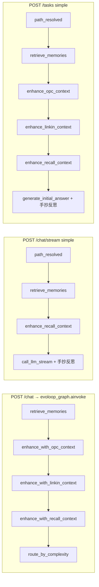

# 路線圖 #1：三軌管線收斂 — 設計提案

| 項目 | 內容 |
| --- | --- |
| 狀態 | 設計提案（未實作） |
| 基線 commit | `fdeb619`（`master`，已含 #6 `POST /routing/preview`、#7 輪次對齊相關合併） |
| 範圍 | `POST /chat`、`POST /chat/stream`（含公司／minecraft_ops 分支）、`POST /tasks` + Task WebSocket |
| 非目標 | AI Hub `/api/v1/*`、OPC 微服務內部六級圖、前端 Grill 產品邏輯重寫 |

## 1. 問題與目標

三個產品入口各自維護「前置增強 → 生成 → 反思閉環 → 收尾」，只有 `POST /chat` 完整走 `build_graph().ainvoke`；其餘為手抄迴圈或旁路編排。結果是**同一句 query** 可能出現：路徑標籤一致但注入上下文不同、反思輪數或終止條件不同、交付前長度／質量門不同、trace 覆蓋不全。

**驗收目標（實作階段）**

- 同一 query（含 `semantic_lock.locked_brief`）在三入口的 `path`、注入上下文、反思輪數上限與實際 `iteration` 一致（允許串流在 token 切分上與 batch 字串相同）。
- 既有測試全過；新增契約測試鎖死上述一致性。
- **TTFT** 驗收分兩類（詳 §7）：未命中 OPC／靈境增強的 query **零回歸**；命中者允許明確上限或並行／超時降級。

---

## 2. 現況盤點（三入口對照）



### 2.1 對照表

| 能力 | `POST /chat` | `POST /chat/stream` | `POST /tasks` + WS |
| --- | --- | --- | --- |
| **路由** | `route_by_complexity`（`company_nodes.py` L101–134） | `build_routing_preview` + 分支（`main.py:chat_stream` L1275+） | `build_routing_preview`（`task_manager.py:_run_unified_task` L694–709） |
| **OPC 注入** | 圖節點 async | simple：**缺** ⚠️ | 有 |
| **靈境 RAG** | 圖節點 | simple：**缺** ⚠️ | 有 |
| **recall** | 圖節點 | 有 | 有 + `recall_assembled` |
| **反思迴圈** | `should_improve` | `reflection_should_continue`（simple）；公司 SSE 仍用 `PASS_THRESHOLD` ⚠️ | `_run_reflection_loop` |
| **收尾** | decide → enforce_final → save → archive | simple：僅 `save_memory` ⚠️ | `finalize_task_answer` |
| **`record_outcome`** | `decide_final_answer`（`nodes.py` L569–583） | **無** ⚠️ | 經 finalize |
| **Billing** | **無** `begin_chat_billing`（`main.py:chat` L941–966）— **今日同步 chat 未走 chat 計費上下文**（見 §5.2） | `begin_chat_billing` + `event: billing` | `begin_billed_task`、402 |
| **客戶端中斷** | N/A | **無**協作式 cancel ⚠️（§3.5） | `cancel_task` + grace |

### 2.2 關鍵分歧

1. Simple SSE 缺 OPC／靈境（P1）。
2. OPC 六級僅 Task（Q1）。
3. 公司 SSE 反思常數與 graph 分叉（P2）。
4. SSE 無 finalize／`record_outcome`（P2）。
5. 串流 disconnect 未停 LLM／未 skip save（§3.5）。

---

## 3. 目標架構：`run_unified_pipeline`

### 3.1 原則

單一編排核心（圖或同拓撲 `run_pipeline_stages`）；HTTP／Task 只訂閱 `PipelineEvent`；simple 路徑允許 `token_sink`，反思仍用 `nodes.*` 同步節點。

### 3.2 介面（摘要）

`run_unified_pipeline(req: PipelineRequest, mode=BATCH|STREAM|TASK, emit=…, token_sink=…)` → `EvoLoopState`。`mode=stream`：company 保留 EventBus；minecraft_ops 用 `ainvoke`；simple 用共用前置 + stream 生成 + 共用反思。

### 3.3 串流選型

採 **混合 B**（非全圖 `astream_events`），避免評估節點阻塞首 token。P1 後 TTFT 瓶頸在 **前置增強 I/O**（§7），不在 LangGraph 編譯。

### 3.4 分階段 Feature Flag（取代單一總開關）

**問題**：單一 `EVOL_UNIFIED_PIPELINE=1` 會把「改答案的 P1」與「改反思／收尾的 P2」「改同步入口的 P3」捆在一起，無法在 prod 獨立試水溫。

**提案**：環境變數 `EVOL_UNIFIED_PIPELINE`，取值：

| 值 | 啟用階段 | 預設 | Prod 開啟需 PM 簽核 |
| --- | --- | --- | --- |
| `off`（或空） | 全關 | **是** | — |
| `pre` | P1：SSE simple 跑共用 `run_pre_route_enhancements`（OPC+Linkin+順序與 Task 一致） | 否 | **是**（改回答、改 TTFT） |
| `reflect` | P2：`reflect` 含 P1；共用 `run_reflection_phases` + finalize + 公司 SSE 對齊 | 否 | **是**（改 iteration／長度交付） |
| `batch` | P3：`batch` 含 P2；`POST /chat` 走 `run_unified_pipeline(BATCH)` | 否 | **是**（可能啟用 chat 計費行為，見 Q7） |
| `full` | P4：清理死碼、可選前置並行、bench 進 CI | 否 | 工程內部 |

實作細節：`unified_pipeline.py` 內 `pipeline_level() -> Literal["off","pre","reflect","batch","full"]`，各入口只讀一次。

P0 僅引入旗標解析與契約測試，**行為等同 `off`**。

### 3.5 串流模式：客戶端斷開與中止（與 Task cancel 對齊）

**現況**：`event_stream` 在 `finally` 呼叫 `end_chat_billing`（`main.py` L1551–1552），但生成執行緒 `run_in_executor(_produce_tokens)` **不會**因客戶端斷開而停止；`save_memory` 在完整迴圈結束後仍可能執行；無 `record_outcome` 中斷語意。

**目標行為**（`run_unified_pipeline(STREAM)` 實作要求）：

```text
客戶端關閉 SSE / ASGI disconnect
  → 設 pipeline_cancelled（asyncio.Event）
  → 取消 token 生產 Future / 向 call_llm_stream 注入可中止 hook（與 Task 強制 cancel 同級意圖）
  → 反思迴圈每輪開頭檢查 cancelled：跳過 reflect/improve/evaluate
  → 不呼叫 save_memory、不呼叫 decide_final_answer/record_outcome（或 record 標記 aborted，見下）
  → billing：end_chat_billing 前將 snapshot 標 interrupted=True、reason=client_disconnect；已 meter 的 LLM 調用保留（與 Task 取消一致）
  → 可選 emit event: error code=CLIENT_DISCONNECT（非必須，客戶端已離線）
```

與 Task 對照：`cancel_requested` + `CANCEL_GRACE_SECONDS`（`task_manager.py` L524–557）→ 串流用 **即時** disconnect 偵測（Starlette `request.is_disconnected()` 或 `asyncio.CancelledError` on send）。

**測試**：mock disconnect 在首 token 後／反思中 assert `save_memory` 未呼叫、`record_outcome` 未呼叫、`chat_billing_snapshot()["interrupted"]` 為真。

---

## 4. 分階段實施計畫

| 階段 | 範圍 | 旗標 | 測試 | 工作量 |
| --- | --- | --- | --- | --- |
| **P0** | 骨架 + `pipeline_level()` + 契約測試 | `off` | path/complexity/max rounds | **S（~2–3 人日）** |
| **P1** | 共用前置增強；SSE 接入；TTFT bench 雙路徑 | `pre` | 注入探針 + §7.4 同程 A/B | **M（~4–5 人日）** |
| **P2** | 反思／finalize 單源；`record_outcome` 單次；串流 cancel | `reflect` | `test_task_reflection_alignment`、record_outcome 單次、disconnect | **M（~5–6 人日）** |
| **P3** | `/chat` batch 包裝 + 響應元資料 + 計費決策落地 | `batch` | 同步響應契約、billing 用例 | **S（~2–3 人日）** |
| **P4** | 死碼清理、前置可選 gather、CI bench | `full` | 同程 TTFT 回歸 | **S（~2 人日）** |

**總工作量估算**：約 **15–19 人日**（含測試與文檔；不含 Q1 OPC 六級大行為變更）。

---

## 5. 對外 API 行為變更

### 5.1 `POST /chat/stream`（simple）

| 變更 | 分類 |
| --- | --- |
| 新增 OPC／Linkin 前置 phase（P1） | 非 breaking（事件） |
| 命中 OPC／靈境時 **答案變化** | 語意 breaking |
| P2：`finalize_task_answer` 鏈 | 可能改交付長度 |
| P2：每請求 **一次** `record_outcome`（經 `decide_final_answer`） | **行為／數據 breaking（內部）**：#9 `routing_feedback` 樣本量上升、simple 路由統計更完整，可能更快觸發 `company_ratio_capped` / 長度自適應（`routing_feedback.py`） |
| P2：客戶端斷開不再保證 `done`／`save_memory` | 非 breaking（客戶端已離線） |

### 5.2 `POST /chat`（同步）— Billing（**Q7**）

| 現況 | P3 若走 unified batch 的兩種產品選項 |
| --- | --- |
| **今日未計量展示**：無 `begin_chat_billing`、響應無 `billing` 欄位；與 `/chat/stream` 不一致 | **A. 維持不計量**：batch 仍直接 `ainvoke`，僅代碼路徑統一，**無** 402／無 `billing` 欄位 |
| | **B. 與 SSE 對齊計量**：batch 包裝內 `begin_chat_billing`；超限 402 或響應帶 `billing` — **API breaking** |

**必須在 P3 前由 PM 定案（Q7）**；文件預設建議 **A**，避免未告知的 402。

### 5.3 `record_outcome`（P2，§5.1 已述）

- 僅在成功走完 `decide_final_answer` 且未 `pipeline_cancelled` 時呼叫 **一次**。
- `finalize_task_answer` 與 graph `decide_final_answer` 共用實作；Task 路徑不得再額外 `record_outcome`。
- **測試**：`test_record_outcome_once_per_request` — mock `record_outcome`，SSE／Task／batch 各一請求，assert `call_count == 1`；disconnect 案例 assert `call_count == 0`。

### 5.4 其他入口

（Company SSE 反思、Task 事件名、OPC 六級 Q1、前端適配 — 同 v1 §5.2–5.5。）

### 5.5 Breaking 清單（供 PM）

1. P1：Simple 串流 OPC／靈境 query 答案與現網不同。  
2. P2：極長答案交付與 `record_outcome` 副作用。  
3. P3（若 Q7=B）：同步 `/chat` 可能 402 或出現 `billing`。  
4. Q1：OPC 六級廢止 — 重大 breaking。

---

## 6. 風險與待決問題

| # | 問題 | 阻塞階段 | 建議 |
| --- | --- | --- | --- |
| **Q1** | path=opc 三入口語意 | P1 文檔、長期實作 | 先 C；不阻塞 P1 |
| **Q2** | 全圖 ainvoke vs 混合 B | — | 已選 B |
| **Q3** | semantic_lock vs auditor_ticket | P1 | Task 映射到 `PipelineRequest` |
| **Q4** | 公司 SSE vs 圖 `run_company` | P2 | 保留 Orchestrator |
| **Q5** | Billing 事件時機 | P2 串流 | 與現 SSE 一致 |
| **Q6** | 手抄 while 禁令 | P2 合併後 | CONTRIBUTING |
| **Q7** | **同步 `/chat` 是否計量／402** | **P3** | 預設 A（維持今日未計量） |
| **Q8** | P1 OPC 命中時 TTFT：硬等待 vs **並行+超時**（`EVOL_PRE_ENHANCE_TIMEOUT_MS`） | **P1 上線** | 預設：miss 零成本；hit 允許 ≤`max(opc_p95, linkin_p95)+20ms` 或超時 skip 注入（與 `/chat` 不一致需打標 `opc_degraded`） |

### 6.1 PM 決策順序（建議）

```text
Q7（P3 前必須） ← 僅影響 batch 計費
Q8（P1 上 prod 前必須） ← TTFT／降級策略
Q1（OPC 六級） ← 獨立於 P0–P2，可並行討論
Q3 ← P1 合併前
Q4、Q5 ← P2 設計評審
```

**可立即開工**：P0（無 PM 決策）。**P1 合併到 prod** 需 Q8 + P1 簽核。**P3** 需 Q7。

---

## 7. TTFT 量測與驗收（修訂）

### 7.1 定義

- **TTFT**：`POST /chat/stream`（`execution_strategy=simple`，`path` 為 simple）從請求發出到第一個 `event: token`（ms）。
- **前置窗**：`path_resolved` 之後至首 token 之前所有同步／await 階段（含 P1 新增的 OPC／Linkin）。

### 7.2 增強器成本分析（讀碼結論）

| 節點 | 關鍵字／條件門控 | I/O | Embedding / RAG | LLM |
| --- | --- | --- | --- | --- |
| **`enhance_with_opc_context`**（`company_nodes.py` L58–68） | `needs_opc_context(query)`（`execution_path._OPC_KEYWORDS`）；**未命中**立即 `_opc_context("not_required")` | **命中**：`await sense_opc` → HTTP `opc_service` 或 edge JSON 快取（`opc_service/sense.py` L64–71，timeout 10s） | 無 | 無 |
| **`enhance_with_linkin_context`**（`linkin/pipeline.py` L139–192） | 未同時滿足 `world_hit`／`mc_hit`／`obs_hit`／`players_presence_block` 則 **`return {"linkin_context": {}}`**（L191–192） | `world_hit`：`get_store().search` Chroma／JSON（L198–204）；`mc_hit`：`connector_status_brief()`；可觀測性：`build_ai_context` | **RAG 檢索含 embedding 查詢**（Chroma 路徑） | 無 |
| **`retrieve_memories`** | 無關鍵字門控（總執行） | Chroma `search_similar` | 是（向量檢索） | 无 |
| **`enhance_with_recall_context`** | 內部依整合源 fail-open | 可能 HTTP 多源 | 可能有 | 無 |

**P1 真實風險**：基線 bench 若 stub 掉 enhancer（v1），會**低估** P1；必須分 query 類型量測。

### 7.3 VM 實測（`master` @ fdeb619，本機 OPC 未啟動）

| Query 類型 | `enhance_with_opc_context` p50 | `enhance_with_linkin_context` p50（warm） |
| --- | --- | --- |
| 未命中（例：「今天天氣如何」） | **~0 ms** | **~0.25 ms**（僅 regex） |
| OPC 命中（「產線馬達溫度…」） | **~14 ms**（HTTP 快速失敗） | ~0.25 ms（未走靈境 RAG） |
| 靈境世界觀（「靈境精靈森林…」） | ~0 ms | **~7.3 ms**（p95 ~10 ms；Chroma 降級 JSON） |
| MC 單步控制 | ~0 ms | **~6.8 ms**（MCP 摘要 + 可觀測性，無 world RAG） |

OPC 服務可用時，命中延遲可能升至 **數十–數百 ms**（受 `EVOL_OPC_TIER`／edge TTL 影響）；**不可**用單一絕對毫秒閘門跨 CI runner。

### 7.4 驗收標準（兩段式）

**(a) 未命中 OPC 且未命中 Linkin 注入**（與 `build_routing_preview.reason_codes` 無 `opc_keyword`／靈境注入等價判斷）

- 同一進程內 **A/B**：`EVOL_UNIFIED_PIPELINE=off` vs `pre`，各 ≥30 次 TTFT。
- 通過：`median(TTFT_pre) <= median(TTFT_off) * 1.05 + 5ms` 且 `p95_pre <= p95_off * 1.10 + 10ms`。
- **不得**回歸（相對 off 為準）。

**(b) 命中 OPC 或 Linkin 注入**

- 產品選項（需 Q8）：  
  - **B1**：允許 TTFT 增加 ≤ `measured_enhancer_p95 + 15ms`（相對 off，同 query 類型）。  
  - **B2**：`asyncio.gather(recall, opc)` + Linkin 與 generate 無依賴時並行；OPC `wait_for(timeout=EVOL_PRE_ENHANCE_TIMEOUT_MS)` 失敗則 skip 注入並在 `path_resolved` 或 phase payload 帶 `degraded: true`。  
- 命中類 query **不**與 (a) 混跑同一閾值。

### 7.5 CI 腳本（`scripts/bench_stream_ttft.py`）

- **同程相對比較**：單一 pytest 進程內先跑 `off` 再跑 `pre`（或 parametrize 順序固定），mock `call_llm_stream` sleep 5ms；enhancer **不** mock（或 OPC mock 固定 1ms 僅用於單元測試分支）。
- 輸出：`ttft_off_p50`、`ttft_pre_p50`、`ratio`；失敗時打印 phase 時間分解（optional spans）。
- **禁止**跨 job 絕對閾值（如 v1 的 41ms）。

### 7.6 生產可觀測

- `TraceLogger.log_custom("stream_ttft", {ms, preview_path, opc_status, linkin_active})`（flag≥`pre`）。

---

## 8. 程式锚點

| 符號 | 位置 |
| --- | --- |
| OPC 增強 | `backend/core/company_nodes.py:enhance_with_opc_context` L58–95 |
| 靈境增強 | `backend/linkin/pipeline.py:enhance_with_linkin_context` L139–234 |
| `record_outcome` | `backend/core/nodes.py:decide_final_answer` L569–583 |
| Task finalize | `backend/core/nodes.py:finalize_task_answer` L83–88 |
| SSE 計費 | `backend/main.py:event_stream` L1315–1316、L1551–1552 |
| 同步 chat（無計費上下文） | `backend/main.py:chat` L941–966 |

---

## 9. 驗收測試清單

1. 契約：三入口 path／complexity／max rounds。  
2. P1：注入探針（SSE = batch）。  
3. P2：反思 iteration 一致；**`record_outcome` 恰一次**；disconnect 零次。  
4. `test_length_gate` SSE 用例。  
5. §7.5 同程 TTFT A/B（miss 類 query）。  
6. P2：串流 cancel 與 billing `interrupted`。

---

## 10. 摘要

三軌收斂 = **單一階段編排 + 分級旗標（pre/reflect/batch）+ 分類 TTFT 驗收**。P1 的 OPC／Linkin 在 miss 時近乎零成本，真實風險在 **命中時 I/O**；驗收以 **同進程 off vs on 相對比** 為準。P2 起 SSE 將進入 `record_outcome` 閉環，須防雙重計數並預期路由反饋動態變化。同步 `/chat` 今日 **未計量**，P3 前必須由 **Q7** 定案是否改為與 SSE 一致。
