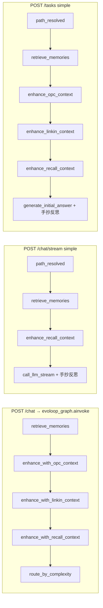

# 路線圖 #1：三軌管線收斂 — 設計提案

| 項目 | 內容 |
| --- | --- |
| 狀態 | 設計提案（未實作） |
| 基線 commit | `fdeb619`（`master`，已含 #6 `POST /routing/preview`、#7 輪次對齊相關合併） |
| 範圍 | `POST /chat`、`POST /chat/stream`（含公司／minecraft_ops 分支）、`POST /tasks` + Task WebSocket |
| 非目標 | AI Hub `/api/v1/*`、OPC 微服務內部六級圖、前端 Grill 產品邏輯重寫 |

## 1. 問題與目標

三個產品入口各自維護「前置增強 → 生成 → 反思閉環 → 收尾」，只有 `POST /chat` 完整走 `build_graph().ainvoke`；其餘為手抄迴圈或旁路編排。結果是**同一句 query** 可能出現：路徑標籤一致但注入上下文不同、反思輪數或終止條件不同、交付前長度／質量門不同、trace 覆蓋不全。

**驗收目標（實作階段）**

- 同一 query（含 `semantic_lock.locked_brief`）在三入口的 `path`、注入上下文、反思輪數上限與實際 `iteration` 一致（允許串流在 token 切分上與 batch 字串相同）。
- 既有測試全過；新增契約測試鎖死上述一致性。
- `/chat/stream` simple 路徑 **TTFT**（首個 `event: token`）相對基線不退化（建議閾值：p50 ≤ 基線 × 1.10 + 15ms）。

---

## 2. 現況盤點（三入口對照）

圖 1 為 LangGraph 單一真相（`backend/core/graph.py:build_graph`）；圖 2–4 為三入口實際執行路徑。



### 2.1 對照表

| 能力 | `POST /chat` | `POST /chat/stream` | `POST /tasks` + WS |
| --- | --- | --- | --- |
| **路由解析** | `route_by_complexity` → `resolve_execution_path`（`backend/core/company_nodes.py:route_by_complexity` L101–134） | 入口：`chat_stream_uses_company_sse` / `resolve_execution_path`（`backend/main.py:chat_stream` L1275–1289）；simple 分支用 `build_routing_preview`（L1327–1333） | `build_routing_preview` + `resolve_task_complexity`（`backend/services/task_manager.py:_run_unified_task` L694–709） |
| **`build_routing_preview`** | 間接（圖內路由同源函式） | simple／company／minecraft_ops 開頭 `event: path_resolved`（`main.py:_sse_path_resolved` L1201–1202） | `path_resolved` 事件 payload = 完整 preview（L708–709） |
| **OPC 關鍵詞** | 圖節點 `enhance_with_opc_context`（async） | **simple 分支：未呼叫** ⚠️ | `_run_simple_task` / `_run_minecraft_ops_task` 有呼叫（L807–809 等） |
| **靈境 RAG** | `enhance_with_linkin_context` | **simple 分支：未呼叫** ⚠️ | `enhance_with_linkin_context`（L820–822 等） |
| **整合 recall** | `enhance_with_recall_context` | 有（`main.py:event_stream` L1362–1374） | 有 + `recall_assembled` 事件（task_manager L833–851） |
| **記憶** | `retrieve_memories` | 有（L1351–1358） | 有 | 
| **semantic_lock / locked_brief** | 改寫 `query`（`main.py:chat` L946–948） | 路由用 `query_for_route`，state 再改寫（L1324–1349） | `create_task` 用 options `semantic_brief` / `auditor_ticket`（task_manager L430–435），**非** Chat 的 `semantic_lock` 欄位 ⚠️ |
| **節點序列（simple）** | RM→OPC→LK→RC→`generate_initial_answer`→長度守門→評估→反思迴圈→`decide_final_answer`→`enforce_final_length`→`save_memory`→`archive_state` | RM→RC→**`call_llm_stream`**→`enforce_output_length`→手抄 evaluate/reflect/improve→**僅** `save_memory` | RM→OPC→LK→RC→`generate_initial_answer`→`_run_reflection_loop`→`finalize_task_answer` |
| **反思上限** | `reflection_max_iterations` + `should_improve`（`graph.py` L84–136） | `reflection_should_continue(state)`（`main.py` L1447） | `_reflection_should_continue` → `reflection_should_continue`（task_manager L938–941） |
| **反思上限（公司 SSE）** | 圖內 `run_company` + `should_evaluate_company` | `_company_stream` 手抄：`PASS_THRESHOLD` / `MAX_ITERATIONS`（`main.py` L1114–1117）⚠️ 未用 `resolve_pass_threshold` / `reflection_max_iterations` | `_run_post_company_reflection` + 手抄 full 模式（task_manager L1005+） |
| **minecraft_ops** | 圖 `run_minecraft_ops`（`graph.py` L212） | 子流程 `_minecraft_ops_stream` → **完整** `ainvoke`（`main.py` L1208–1257） | 手抄前置 + `run_minecraft_ops` + `_run_reflection_loop`（task_manager L735–761） |
| **OPC 六級（path=opc）** | 圖仍走 `generate_initial_answer`（`execution_path.py:route_by_complexity_target` L201–206 將 opc 映射為 generate）⚠️ | 落入 simple SSE，**無**六級、**無** OPC 注入 ⚠️ | `_run_opc_task` 獨立六級（task_manager 分派 L713–714） |
| **post_company_reflect** | `should_evaluate_company` + 圖邊 | `_company_stream` 讀 `post_company_reflect_mode()`（L1074+） | `_run_post_company_reflection` |
| **Grill／審計 gate** | 無後端 gate；前端 `streamAuditor` / Grill（`frontend/src/api/client.ts`） | 同左；#6 要求僅 `preview.path=company` 觸發（前端） | Task options `auditor_ticket` 改寫 query（task_manager L431–435） |
| **Billing** | 同步 chat 無 `begin_chat_billing` | `begin_chat_billing` + 可選 `event: billing`（`main.py` L1315、L1422+） | `create_task` → `begin_billed_task`（`main.py:create_task` L1514–1525） |
| **routing_feedback `record_outcome`** | `nodes.decide_final_answer`（`nodes.py` L569–583） | **無**（未走 decide_final_answer）⚠️ | `finalize_task_answer` 內含 decide（`nodes.py:finalize_task_answer` L83–88） |
| **pipeline_trace `log_node`** | 各 graph 節點（如 `nodes.py` L227、L583；`company_nodes.py` L127–129） | simple：**無** `log_node`（僅 TraceLogger phase）⚠️ | TraceLogger；**無** `pipeline_trace.log_node` ⚠️ |
| **對外事件** | JSON `ChatResponse` | SSE：`path_resolved`、`phase`、`token`、`evaluation`、`answer`、`done`、`billing`、`error`、`company`（公司） | REST `events[]`；WS 廣播同名 `event`（`task_manager._add_event` L594–601） |
| **錯誤／中斷** | 例外 → HTTP 500 | SSE `error` + credits `INSUFFICIENT_CREDITS`（L1534–1547） | `cancel_requested`、強制 cancel 寬限期（task_manager L551+）、`task_finished` |

### 2.2 已對齊項（#6/#7 後）

- Task 與 Chat SSE simple 均使用 `build_routing_preview`、`reflection_should_continue`、`resolve_task_complexity`（見 `test_execution_path_unified.py`、`test_task_reflection_alignment.py`）。
- SSE `done` 與 Task `task_finished` 已帶 `complexity`、`reflection_rounds_used`、`reflection_rounds_max`（`main.py` L1524–1530；task_manager L646–647）。

### 2.3 關鍵分歧（實作必消除）

1. **Simple SSE 缺 OPC／靈境增強** — 與 `/chat`、Task 不一致（工業／靈境 query 答案會偏）。
2. **OPC path** — Task 走六級；`/chat` 圖與 SSE 走「注入 + simple 生成」；**三軌語意未定義為一致**（需 PM 決策，見 §6）。
3. **公司 SSE 反思終止** — 仍用固定 `PASS_THRESHOLD`/`MAX_ITERATIONS`，與 `should_improve` + `reflection_max_iterations` 分叉。
4. **收尾鏈** — SSE simple 缺 `decide_final_answer`、`enforce_final_length`、`archive_state`、`record_outcome`。
5. **生成實作** — SSE 用 `call_llm_stream` + `build_generate_prompt`；圖用 `generate_initial_answer`（同一 prompt 建構器，但串流切 token 與 thinking 拆分時序不同）。
6. **Chat 同步響應** — 無 `path`/`complexity`/`reflection_rounds_*` 欄位，與 SSE/Task 不對稱。

---

## 3. 目標架構：`run_unified_pipeline`

### 3.1 設計原則

1. **單一編排核心**：要麼編譯圖 `ainvoke` / `astream_events`，要麼抽出與圖拓撲一致的 `async def run_pipeline_stages(...)`（禁止第三套 while）。
2. **傳輸層薄**：HTTP SSE、Task 事件、同步 JSON 只訂閱同一 `PipelineEvent` 流。
3. **串流特殊情況**：僅在「simple 路徑首次生成」允許 token 級 callback；反思／評估仍走同步節點（與現網一致，利於 TTFT）。

### 3.2 介面草案

新增模組建議：`backend/core/unified_pipeline.py`（名稱可調）。

```python
@dataclass
class PipelineRequest:
    query: str
    session_id: str
    task_id: str | None
    history: list[dict]
    execution_strategy: str
    company_template: str | None
    semantic_lock: dict
    ui_language: str | None
    options: dict  # Task 專用（auditor_ticket、model…）

class PipelineMode(Enum):
    BATCH = "batch"      # POST /chat
    STREAM = "stream"    # POST /chat/stream
    TASK = "task"        # POST /tasks 背景

async def run_unified_pipeline(
    req: PipelineRequest,
    *,
    mode: PipelineMode,
    emit: Callable[[PipelineEvent], Awaitable[None]] | None = None,
    token_sink: Callable[[str], Awaitable[None]] | None = None,
) -> EvoLoopState:
    ...
```

**`mode` 語意**

| mode | 行為 |
| --- | --- |
| `batch` | `await evoloop_graph.ainvoke(initial_state)`；可選將 LangGraph `astream_events` 轉為 `emit`（供日後統一 trace） |
| `stream` | company → 保留 EventBus→SSE 适配，但 post_company_reflect 改調共用 `run_reflection_phases`；minecraft_ops → `ainvoke`；simple → **共享前置節點** + `token_sink` 生成 + 共用反思階段 |
| `task` | 與 stream 共用階段函式；`emit` 映射到 `_add_event` / `_broadcast_event`；支援 cancel checkpoint |

**事件契約（內部）**

```python
@dataclass
class PipelineEvent:
    kind: Literal[
        "path_resolved", "phase", "token", "evaluation",
        "answer", "company", "billing", "error", "done",
    ]
    payload: dict[str, Any]
```

HTTP 層維持現有 SSE 名稱；adapter 負責 `kind` → `event: …`。

### 3.3 串流技術選型

| 方案 | 說明 | TTFT | 建議 |
| --- | --- | --- | --- |
| **A. 全圖 `astream_events`** | 所有路徑含公司 | 公司路徑首 token 極晚；需大量改造節點為 async stream | 否 |
| **B. 混合：圖 batch + simple 生成 hook** | simple：前置節點順序執行（與圖相同）→ `generate_with_stream_hook` → 反思呼叫現有 `nodes.*`；company/mc_ops 維持現分支但反思共用 | 與現網相同：TTFT ≈ preview + RM + OPC + LK + RC + 首 token | **是** |
| **C. 僅共享 while 迴圈** | 抽函式但仍三處呼叫 | 易再次分叉 | 否（過渡可接受） |

**選 B 的理由**：現網 TTFT 瓶頸在「`path_resolved` 之前後的同步前置」與首次 `call_llm_stream`（`main.py:event_stream` L1347–1376），不在 LangGraph 編譯 overhead。統一前置節點後，不強制 simple 路徑 `ainvoke` 全圖，可避免在評估節點阻塞首 token。

**TTFT 保護措施**

- 前置節點並行化（僅當依賴允許）：例如 recall 與 OPC sense 可 `asyncio.gather`（需實作階段量測）。
- Feature flag 關閉時回退現 `event_stream`（`EVOL_UNIFIED_PIPELINE=0`）。
- 契約測試記錄「前置 phase 列表 + 順序」與基線一致。

### 3.4 與 `pipeline_trace` 整合

在共享階段 wrapper 內對每個節點呼叫 `pipeline_trace.log_node`（`backend/core/pipeline_trace.py:log_node` L32–40），使三入口寫入同一 `TraceLogger` 檔案規則（`task_id` 或 `session_id`）。

---

## 4. 分階段實施計畫

| 階段 | 範圍 | 主要檔案 | 測試 | 回滾 | 工作量 |
| --- | --- | --- | --- | --- | --- |
| **P0 契約與旗標** | 新增 `run_unified_pipeline` 骨架 + `EVOL_UNIFIED_PIPELINE`；無行為變更 | `core/unified_pipeline.py`、`tests/test_unified_pipeline_contract.py` |  golden：preview.path、complexity、max rounds 三入口一致 | 預設 `0` | S |
| **P1 Simple 前置對齊** | SSE simple 補 `enhance_with_opc_context` / `enhance_with_linkin_context`；抽 `run_pre_route_enhancements(state)` 與 Task 共用 | `main.py`、`task_manager.py`、`unified_pipeline.py` | 擴充 `test_recall_chat_path` / 新測 OPC 注入出現在 `build_generate_prompt` | flag off | M |
| **P2 反思／收尾單源** | 刪除三處手抄 while；共用 `run_reflection_phases`（內部 `reflection_should_continue` + `finalize_task_answer`）；公司 SSE 改用同一 helper | `main.py`、`task_manager.py`、`graph.py`（可 export helper） | 既有 `test_task_reflection_alignment.py`、`test_length_gate.py` SSE 用例 | flag off | M |
| **P3 `/chat` batch 與 trace** | `chat()` 改薄包裝 `run_unified_pipeline(BATCH)`；補 optional 響應欄位（見 §5） | `main.py` | `test_execution_path_unified` + 新同步響應契約 | flag 雙路徑 | S |
| **P4 清理與 TTFT** | 移除死碼；可選前置 gather；新增 `scripts/bench_stream_ttft.py` 進 CI（mock LLM） | `scripts/`、CI 配置 | TTFT p50 回歸 | flag 移除（另 PR） | S–M |

---

## 5. 對外 API 行為變更

### 5.1 `POST /chat/stream`（simple）

| 變更 | 分類 | 說明 |
| --- | --- | --- |
| 新增 `phase: enhance_opc_context` / `enhance_linkin_context`（或合併為 `phase: enhance_context`） | **非 breaking**（新增） | 與 Task 對齊；前端若只認 `retrieve_memories`/`generate` 可忽略 |
| OPC／靈境命中時 **答案內容變化** | **行為 breaking（語意）** | 與 `/chat` 一致化；需產品說明 |
| 反思後答案經 `decide_final_answer`/`enforce_final_length` | **可能 breaking** | 極長答案可能被截斷／改選最短版（與 `/chat` 一致） |
| `event: path_resolved` 維持獨立事件（#6） | 不變 | 已與 preview API 同 schema |

### 5.2 `POST /chat/stream`（company）

| 變更 | 分類 |
| --- | --- |
| 反思終止改用 `resolve_pass_threshold` + `reflection_max_iterations` | **可能改變** `iteration`／提前停止時機 |
| `done.reflection_rounds_*` 與實際一致化 | 非 breaking |

### 5.3 `POST /chat`（同步）

| 變更 | 分類 |
| --- | --- |
| 建議新增可選欄位：`resolved_path`、`complexity`、`reflection_rounds_used/max` | **非 breaking**（擴充 `ChatResponse`） |

### 5.4 `POST /tasks` / WS

| 變更 | 分類 |
| --- | --- |
| 事件順序與 SSE 對齊（前置 phase 名稱一致） | 非 breaking |
| 若 OPC 與 `/chat` 對齊為「僅注入」而廢棄 Task 六級 | **重大 breaking** — 需 PM 決策（§6） |

### 5.5 前端適配（建議）

1. **InputBar / chatWorkspace**：已依 `POST /routing/preview` 顯示路徑；確認 Grill 僅 `path === 'company'`（#6）。
2. **SSE 解析**：容忍新 `phase`；`path_resolved` 已是獨立 event（勿再當 `phase`）。
3. **Task 監控**：`path_resolved` payload 已是完整 preview，與聊天一致。
4. **答案差異**：工業／靈境 simple 聊天串流答案可能變長／含上下文 — UI 無需改，但需發布說明。

### 5.6 Breaking 清單（供 PM 簽核）

1. Simple 串流在 OPC／靈境 query 上 **回答內容** 與現網不同（與 `/chat` 對齊）。
2. Simple 串流 **極長回答** 交付行為與 `/chat` 一致（可能更短或帶 `length_warning`）。
3. （可選）若統一 OPC 為「僅注入」：**Task OPC 六級行為廢止** — 重大 breaking。
4. Company SSE **反思輪數** 可能隨動態門檻變化 — 中等風險。

---

## 6. 風險與待決問題

| # | 問題 | 選項 | 建議 |
| --- | --- | --- | --- |
| Q1 | **path=opc** 三入口語意 | A) Task 六級為準，Chat/SSE 改分派六級；B) 全改「注入 + simple/company」；C) 維持分裂、契約測試分開 | 先 **C + 文檔化**；長期 **B** 與圖一致 |
| Q2 | Simple 串流是否必須 **全圖 ainvoke** | 是 = TTFT 風險高；否 = 混合 B | **混合 B** |
| Q3 | `semantic_lock` vs Task `auditor_ticket` | 統一為 `PipelineRequest.semantic_lock` | 是，Task 建立時映射 |
| Q4 | 公司路徑是否統一走圖 `run_company` | SSE 現用 Orchestrator 直連 | 短期保留 Orchestrator，反思單源 |
| Q5 | Billing 事件時機 | 統一在每次 LLM 後 emit | 與現 SSE 一致 |
| Q6 | 刪除手抄迴圈的時間點 | P2 後禁止新增圖外 while | 寫入 `CONTRIBUTING.md` |

---

## 7. TTFT 量測計畫

### 7.1 定義

- **TTFT**：`POST /chat/stream`（`execution_strategy=simple`）從 HTTP 請求發出到**第一個** `event: token` 的時間（ms）。
- **不包含**：公司／minecraft_ops 分支（首 token 定義不同）。

### 7.2 基線方法（本 VM，`master` @ fdeb619）

腳本（實作階段落地 `scripts/bench_stream_ttft.py`）：

- `TestClient` + `LINKIN_AUTH_DISABLED=1`
- `monkeypatch`：`call_llm_stream` 每 chunk `sleep(5ms)`；評估 LLM 固定 9 分；`enhance_with_recall_context` no-op
- 預熱 1 次 + 5 次取 p50

**實測（stub LLM，2026-10-05）**：p50 ≈ **23.6 ms**（樣本 `[210.5, 23.9, 22.7, 23.6, 23.0]`，首筆為冷啟動）。

### 7.3 回歸閾值

- CI：`TTFT_p50 <= baseline_p50 * 1.10 + 15ms`（當前 ≈ **41ms** 上限）。
- 若 P1 並行化前置，需重採 baseline。

### 7.4 實圖 vs stub

- 生產監控：在 `event_stream` 記錄 `metrics.stream_ttft_ms`（feature flag on 時）寫入 TraceLogger custom event — 不阻塞本設計。

---

## 8. 程式锚點（實作參考）

| 符號 | 位置 |
| --- | --- |
| 圖編譯 | `backend/core/graph.py:build_graph` L155–239 |
| 反思路由 | `backend/core/graph.py:should_improve` L84–136；`reflection_should_continue` L139–147 |
| 路由預覽 | `backend/core/routing_preview.py:build_routing_preview` L173–216 |
| 同步聊天 | `backend/main.py:chat` L941–966 |
| SSE simple | `backend/main.py:chat_stream` → `event_stream` L1307–1554 |
| 公司 SSE | `backend/main.py:_company_stream` L977–1174 |
| Task 入口 | `backend/services/task_manager.py:_run_unified_task` L694–730 |
| Task 反思 | `backend/services/task_manager.py:_run_reflection_loop` L943–1003 |
| Prompt 注入 | `backend/core/nodes.py:build_generate_prompt` L206–215；`_format_injected_context` L172–188 |
| Trace | `backend/core/pipeline_trace.py:log_node` L32–40 |

---

## 9. 驗收測試清單（實作 PR）

1. `test_unified_pipeline_contract.py`：矩陣 query × strategy → 三入口 `path`、`task_complexity`、`max_reflection_rounds` 相同。
2. 注入探針：mock `enhance_with_opc_context` / `enhance_with_linkin_context`，斷言 SSE simple 與 `/chat` 均呼叫。
3. 反思：同一 mocked 分數序列 → `iteration` 與 `reflection_rounds_used` 一致。
4. `test_length_gate` SSE 用例仍通過。
5. `scripts/bench_stream_ttft.py` CI 閾值（§7.3）。

---

## 10. 摘要

三軌收斂的核心不是「全部 ainvoke」，而是 **單一階段編排 + 單一反思終止邏輯 + 完整上下文注入**。建議以 `run_unified_pipeline` 為中心、混合串流生成 hook，分五個可獨立合併階段交付；OPC 六級與 Chat 圖分裂需 PM 在 Q1 明確決策後再動行為 breaking 變更。
